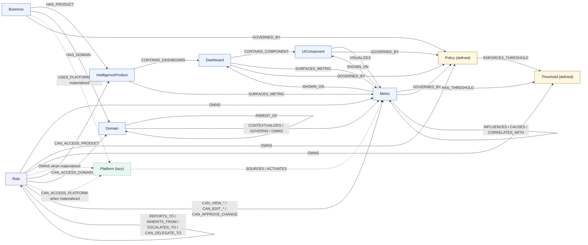

# Final ThoughtWire Knowledge Graph Schema - Codex

Status: source of truth for the current KG-only build  
DB target: Neo4j  
Tenancy model: one isolated graph database per business/client  
Scope: knowledge graph only; decision runtime is deferred

This document replaces the prior six-label-only Codex schema with a business-rooted graph that can represent multiple ThoughtWire intelligence products, decision domains, and source/action platforms. It keeps the current build focused on the knowledge graph. Decision capsules, monitoring contracts, learning memory, and execution runtime are intentionally deferred until the KG is stable.

Claude comparison update: `final-schema-claude.md` remains the strongest analytical reference for field typing, master-config-free metric identity, defined-only governance, seniority/domain-branch RBAC, and metric rollup/decomposition semantics. This Codex document remains the canonical source of truth, with those Claude learnings folded in.

## 1. Final Decision

Use a `Business` root with three orthogonal axes:

```text
Business
  -HAS_PRODUCT-> IntelligenceProduct -CONTAINS_DASHBOARD-> Dashboard -CONTAINS_COMPONENT-> UIComponent -VISUALIZES-> Metric
  -HAS_DOMAIN->  Domain              -CONTEXTUALIZES/GOVERNS/OWNS-----------------------------> Metric
  -USES_PLATFORM-> Platform          -SOURCES/ACTIVATES---------------------------------------> Metric  (when platform traversal is materialized)
```

`Platform` decision: keep `Platform` as a thin, lazily materialized KG node, but also keep platform/source fields on `Metric`. A `Platform` node is not strictly necessary for lineage-only V1 because `Metric.source_set[]`, `Metric.platform_ids[]`, `Metric.connector_ids[]`, and `Metric.mart_sources[]` can store that information. It becomes worth keeping as a node when the graph must answer platform-level questions such as "which metrics depend on GA4?", "who owns Google Ads freshness?", "which dashboards are affected by a degraded connector?", "which roles can access a platform?", or "which future actions can activate this metric?".

Do not create separate `Connector` or `Endpoint` nodes in the current KG. Endpoint and connector data stay as fields, relationship properties, source profiles, and proposal metadata until traversal pressure justifies promotion.

The graph should support these questions from day one:

- Which intelligence products exist for this business?
- Which dashboards and UI components belong to each intelligence product?
- Which business domain owns or reasons about a metric?
- Which platform sourced or can affect a metric?
- Which roles can see, govern, approve, or escalate a metric/domain/product/platform?
- Which metrics causally influence other metrics, with confidence and lag?

## 2. Drawbacks In The Previous Codex File

`docs/finalised-graph-schema-codex.md` was useful as a compact baseline, but it is not enough for the next build.

| Drawback | Why it matters |
|---|---|
| It over-flattened product, domain, and platform structure. | Agents need separate product, domain, and platform axes to reason about decisions cleanly. |
| It treated `IntelligenceProduct` and `Domain` as fields only. | Products drive surfaces and access; domains drive decision ownership and approval. Both need traversal. |
| It had no `Business` root. | There was no place for global company context, defaults, north-star metrics, or business-wide policy. |
| It used stale `master-config` sources. | You indicated those files/endpoints are not latest enough to be trusted for the final KG. |
| It did not model multiple intelligence products cleanly. | A business can have Marketing IQ, Product IQ, Customer IQ, Creative IQ, and Decision Canvas at the same time. |
| Its role/social graph was too shallow. | Real permission needs seniority rank, reporting path, escalation path, explicit scope, and data-classification clearance. |
| It mixed future decision/runtime concepts into KG planning. | The current build should focus on KG structure first; decision runtime comes later. |

## 2.1 What Was Learned From The Claude Final Schema

| Claude contribution | Codex update |
|---|---|
| Stronger `Field / Type / Required / Description` tables. | Codex keeps that table shape as the implementation contract. |
| Master-config-free metric identity. | Codex adopts `metric_uid`, `canonical_id`, and `metric_id` with distinct meanings. |
| Defined-only governance. | `Policy` and `Threshold` are V1 schema shells with `population_status = defined`; instances are not ingested from `master-config`. |
| Seniority and domain-branch RBAC. | Codex uses `Role.seniority_rank`, resource `min_level`, and `data_classification`. |
| Missing rollup/decomposition semantics. | Codex adds `ROLLS_UP_TO`, `DECOMPOSES_INTO`, `SHOWN_ON`, `ENFORCES_THRESHOLD`, and `INHERITS_FROM`. |

## 3. Tenancy And Business Root

There is no `Tenant` node in the graph.

Each business/client gets its own isolated graph database. The database boundary is the tenant boundary. The `Business` node is the root context inside that database; it is not used for multi-tenant isolation.

`rare_seeds` was a pilot/client database name. It is historical context only and must not drive tenancy architecture.

### `Business` Node

`Business` contains company-wide context and defaults. It should not contain dashboards, raw metric values, platform details, or domain-specific rules.

| Field | Type | Purpose |
|---|---|---|
| `business_id` | string | Stable root id inside the graph database. |
| `business_name` | string | Company display name. |
| `business_type` | string | Ecommerce, SaaS, marketplace, retail, services, etc. |
| `industry` | string | Business category. |
| `primary_currency` | string | Default reporting currency. |
| `timezone` | string | Default business timezone. |
| `fiscal_year_start_month` | integer | Fiscal calendar anchor. |
| `default_granularity` | enum | `daily`, `weekly`, `monthly`, `quarterly`. |
| `decision_risk_posture` | enum | `conservative`, `balanced`, `aggressive`. |
| `default_data_classification` | enum | `public`, `internal`, `restricted`, `executive`. |
| `strategic_intent_summary` | string | Company-wide intent agents can quote. |
| `north_star_metrics[]` | string[] | Global priority metric ids or concepts. |
| `operating_constraints[]` | string[] | Global constraints such as brand, cash, inventory, compliance, service quality. |
| `status` | enum | `active`, `paused`, `archived`. |
| `created_at`, `updated_at` | datetime | Audit fields. |

Detailed business data:

| Field | Required | Source | Notes |
|---|---:|---|---|
| `business_id` | yes | bootstrap profile or arbitration writer | Stable root id inside the isolated graph database. |
| `business_name` | yes | reviewed business profile | Display name only; not tenant isolation. |
| `business_type` | recommended | reviewed business profile | Helps default domains, metrics, and policies. |
| `industry` | recommended | reviewed business profile | Used for context, not hardcoded behavior. |
| `primary_currency` | recommended | reviewed business profile | Default for financial metrics. |
| `timezone` | recommended | reviewed business profile | Default for reporting windows and freshness checks. |
| `fiscal_year_start_month` | optional | finance/admin input | Needed for quarterly and annual reporting. |
| `default_granularity` | recommended | business/admin input | Default analysis grain. |
| `decision_risk_posture` | recommended | leadership/admin input | Affects later decision guardrails, not current KG traversal. |
| `default_data_classification` | yes | governance defaults | Default classification inherited when child nodes do not override. |
| `strategic_intent_summary` | recommended | leadership input | Short agent-readable summary of what the company optimizes for. |
| `north_star_metrics[]` | recommended | leadership/domain owner input | References metric ids or concepts after metric catalog exists. |
| `operating_constraints[]` | recommended | leadership/domain owner input | Examples: cash, brand, inventory, service quality, compliance. |
| `status` | yes | arbitration writer | `active`, `paused`, or `archived`. |
| `last_verified_at` | recommended | arbitration writer | Supports business profile drift checks. |

Edges from `Business`:

```text
(:Business)-[:HAS_PRODUCT]->(:IntelligenceProduct)
(:Business)-[:HAS_DOMAIN]->(:Domain)
(:Business)-[:USES_PLATFORM]->(:Platform)  // only when platform traversal is materialized
(:Business)-[:GOVERNED_BY]->(:Policy)
(:Business)-[:OWNED_BY]->(:Role)
```

## 4. Core KG Nodes

Current implementation scope is the knowledge graph. These nodes are part of the KG schema.

Mandatory V1 schema labels: `Business`, `Domain`, `IntelligenceProduct`, `Metric`, `Dashboard`, `UIComponent`, `Policy`, `Threshold`, and `Role`.

| Node | Purpose |
|---|---|
| `Business` | Root company context for one isolated graph database. |
| `IntelligenceProduct` | ThoughtWire product surface such as Marketing IQ, Product IQ, Customer IQ, Creative IQ, Decision Canvas. |
| `Domain` | Decision ownership and reasoning area such as Marketing, Finance, Operations, Service, Product, Inventory, Customer, Risk. |
| `Metric` | Business signal that can be surfaced, governed, monitored, and causally linked. |
| `Dashboard` | Product-owned surface grouping. |
| `UIComponent` | Chart, card, table, KPI, or narrative component. |
| `Policy` | Rule that governs interpretation, access, escalation, or action. |
| `Threshold` | Boundary that turns a metric observation into concern. |
| `Role` | Authority, access, ownership, approval, and escalation node. |

Optional lazy supporting label:

| Node | Current status |
|---|---|
| `Platform` | Thin source/action system label materialized only when platform traversal, ownership, RBAC, freshness, outage, or future action routing needs it. Platform/source data remains on `Metric` either way. |

KG-defined but later-implementation nodes:

| Node | Current status |
|---|---|
| `Outcome` | Schema-defined for causal rollups; implementation can wait until decision/outcome workflows exist. |
| `Tool` | Schema-defined for sanctioned capabilities; execution runtime deferred. |
| `Action` | Schema-defined for possible interventions; execution runtime deferred. |
| `InvestigationRule` | Schema-defined for future required checks; projection/runtime deferred. |
| `ApprovalRule` | Schema-defined for future court workflow; full approval runtime deferred. |

Deferred runtime/memory layers:

```text
Thoughtlet
DecisionCapsule
MonitoringContract
LearningCandidate
PromotedMemory
GraphVersion
EvidenceEvent
CausalRelation
Execution runtime
Capsule Agent lifecycle
```

These belong after the KG can reliably answer context, ownership, governance, and causal traversal questions.

### 4.1 Data Detail Standard

Every KG record should be explicit about identity, ownership, source, status, and refresh behavior. The graph should be usable by agents without forcing them to reverse-engineer whether a field is authoritative, cached, inferred, or pending review.

| Data area | Standard |
|---|---|
| Stable identity | Every node has a deterministic id that does not change when display names or routes change. |
| Display identity | Human-facing names are stored separately from ids. |
| Source ownership | Each node and relationship should carry source metadata or be created by an arbitration writer that records source metadata externally. |
| Review state | Harvested or inferred entities can be `proposed` or `needs_review`; only reviewed entities become `active`. |
| Status over deletion | Missing or retired entities become `deprecated`, `hidden`, `blocked`, or `archived`; they are not deleted by ingestion. |
| Cached context | Denormalized arrays on `Metric` are read caches from graph edges, not independent truth. |
| Audit fields | Nodes and important edges should carry `created_at`, `updated_at`, and preferably `last_verified_at`. |
| Access classification | Sensitive resources must declare `data_classification` and `min_level`, or inherit them from product/domain/policy defaults. |

### 4.2 Source Of Truth vs Cached Fields

The graph edges are the source of truth for traversal. Metric arrays are cached so agents can answer common questions quickly.

| Question | Source of truth | Cached on `Metric` |
|---|---|---|
| Which products surface this metric? | `(:IntelligenceProduct)-[:SURFACES_METRIC]->(:Metric)` and dashboard/component paths | `product_ids[]`, `product_names[]` |
| Which domains own or govern this metric? | `(:Domain)-[:OWNS|GOVERNS|CONTEXTUALIZES]->(:Metric)` | `domain_ids[]`, `domain_names[]`, `domain_owner_role_keys[]` |
| Which platforms source this metric? | `(:Platform)-[:SOURCES]->(:Metric)` when materialized; otherwise reviewed source metadata and `SOURCES` edge properties | `platform_ids[]`, `platform_names[]`, `platform_types[]`, `primary_platform_id` |
| Which dashboards/components display this metric? | `(:Dashboard)-[:CONTAINS_COMPONENT]->(:UIComponent)-[:VISUALIZES]->(:Metric)` | `dashboard_ids[]`, `component_ids[]` |
| Who can access this metric? | Role permission edges plus policy evaluation | Optional precomputed access summaries only after RBAC is implemented |

If an edge and a cached field disagree, the edge wins and the cache must be rebuilt.

### 4.3 Canonical Node Field Catalog

This is the implementation field catalog to keep. It combines the architectural stance from `final-schema-codex.md` with the stronger field typing discipline from `final-schema-claude.md`, `thoughtwire-kg-schema-claude.md`, and `thoughtwire-kg-schema-codex.md`.

Rules carried forward from the other Markdown files:

- Use `final-schema-codex.md` as the canonical source of truth because it captures the requested `Business` root, multiple intelligence products, first-class `Domain`, zero automated `master-config` usage, tenant-agnostic database isolation, and KG-only current scope.
- Borrow the Claude-style table shape: `Field`, `Type`, `Required`, and `Description`.
- Keep `source_set[]` as `string[]`, not as a strict platform enum, because real source lists can exceed the current API enum.
- Normalize `yes`/`no` style booleans into real `bool`.
- Split pipe-delimited source/list values into `string[]` during ingestion.
- Use `json` only for cached summaries, filters, redaction, quality maps, and flexible condition payloads.
- Do not add `tenant_id` to graph nodes; the database boundary is tenant/business isolation.
- Do not use `canonical_key` in the final contract. The canonical business id is `canonical_id`.
- Use `seniority_rank`, not `authority_rank`, for role clearance.

#### `Business`

| Field | Type | Required | Description |
|---|---|---:|---|
| `business_id` | string | yes | Stable root id inside one isolated graph database. |
| `business_name` | string | yes | Human display name for the business. |
| `business_type` | enum(`ecommerce`,`saas`,`marketplace`,`retail`,`services`,`other`) | recommended | Business model used for default domains, metrics, and policy assumptions. |
| `industry` | string | recommended | Vertical context used for agent reasoning and default taxonomy. |
| `primary_currency` | string | recommended | Default currency for financial metrics. |
| `timezone` | string | recommended | Default reporting and freshness timezone. |
| `fiscal_year_start_month` | int | optional | Fiscal calendar anchor, `1` through `12`. |
| `default_granularity` | enum(`daily`,`weekly`,`monthly`,`quarterly`) | recommended | Default reporting grain. |
| `decision_risk_posture` | enum(`conservative`,`balanced`,`aggressive`) | recommended | Company-wide risk posture for later decision guardrails. |
| `default_data_classification` | enum(`public`,`internal`,`restricted`,`executive`) | yes | Default data classification inherited by child resources when unspecified. |
| `root_seniority_rank` | int | recommended | Rank of the top role used by the org graph model. |
| `strategic_intent_summary` | string | recommended | Short agent-readable statement of what the company optimizes for. |
| `north_star_metrics[]` | string[] | recommended | Metric ids or concept keys that represent company-wide priorities. |
| `operating_constraints[]` | string[] | recommended | Business-wide constraints such as cash, brand, inventory, compliance, or service quality. |
| `status` | enum(`active`,`paused`,`archived`) | yes | Lifecycle status of the business root. |
| `created_at` | datetime | yes | Creation timestamp. |
| `updated_at` | datetime | yes | Last update timestamp. |
| `last_verified_at` | datetime | optional | Last human/system verification timestamp. |

#### `IntelligenceProduct`

| Field | Type | Required | Description |
|---|---|---:|---|
| `product_id` | string | yes | Stable product slug, such as `marketing_iq`, `product_iq`, or `customer_iq`. |
| `product_name` | string | yes | Human display name. |
| `product_category` | enum(`analytics`,`decisioning`,`creative`,`operations`,`external`) | yes | High-level product family. |
| `description` | string | recommended | Product purpose for agents and admins. |
| `route_prefixes[]` | string[] | recommended | Current app route prefixes used to map dashboards. |
| `default_domain_ids[]` | string[] | recommended | Domains commonly surfaced by this product. |
| `primary_domain_id` | string/null | optional | Main domain if one product is primarily attached to one decision area. |
| `owner_role_key` | string | yes | Accountable role for product ownership and escalation. |
| `default_data_classification` | enum(`public`,`internal`,`restricted`,`executive`) | yes | Product-wide default data classification. |
| `min_level` | int | yes | Minimum `Role.seniority_rank` required to view product-level resources by default. |
| `source_profile_ids[]` | string[] | recommended | Source profiles that discovered or maintain this product. |
| `status` | enum(`active`,`hidden`,`deprecated`,`planned`) | yes | Product lifecycle status. |
| `created_at` | datetime | yes | Creation timestamp. |
| `updated_at` | datetime | yes | Last update timestamp. |
| `last_verified_at` | datetime | optional | Last verification timestamp. |

#### `Domain`

| Field | Type | Required | Description |
|---|---|---:|---|
| `domain_id` | string | yes | Stable domain slug, such as `marketing`, `finance`, `operations`, or `service`. |
| `domain_name` | string | yes | Human display name. |
| `domain_type` | enum(`business`,`technical`,`risk`,`data_quality`,`ml`) | yes | Domain classification. |
| `parent_domain_id` | string/null | optional | Parent domain when a real hierarchy exists. |
| `owner_role_key` | string | yes | Role accountable for this domain. |
| `default_product_ids[]` | string[] | recommended | Products commonly associated with this domain. |
| `default_platform_ids[]` | string[] | recommended | Platforms commonly used by this domain. |
| `decision_scope_summary` | string | yes | Decisions this domain owns or contextualizes. |
| `approval_policy_summary` | string | recommended | Human summary of approval expectations; machine rules live in `Policy`. |
| `data_classification` | enum(`public`,`internal`,`restricted`,`executive`) | yes | Default classification for domain-owned resources. |
| `min_level` | int | yes | Minimum `Role.seniority_rank` required to view the domain branch. |
| `status` | enum(`active`,`hidden`,`deprecated`,`planned`) | yes | Domain lifecycle status. |
| `created_at` | datetime | yes | Creation timestamp. |
| `updated_at` | datetime | yes | Last update timestamp. |
| `last_verified_at` | datetime | optional | Last verification timestamp. |

#### `Platform`

`Platform` is the one node in this schema that can be lazily materialized. The fields below are the node shape if platform traversal is enabled. If platform traversal is disabled for an early build, keep the corresponding values on `Metric` and on `SOURCES` edge metadata.

| Field | Type | Required | Description |
|---|---|---:|---|
| `platform_id` | string | yes | Stable platform slug, such as `ga4`, `google_ads`, `meta_ads`, `klaviyo`, `shopify`, or `snowflake`. |
| `platform_name` | string | yes | Human display name. |
| `platform_type` | enum(`analytics`,`ads`,`crm`,`ecommerce`,`warehouse`,`activation`,`support`,`finance`,`other`) | yes | Platform class used for filtering, freshness, and future action routing. |
| `connector_id` | string/null | optional | Runtime connector id if known. |
| `connector_family` | string/null | optional | Connector group such as `google`, `meta`, `shopify`, or `warehouse`. |
| `owner_role_key` | string | recommended | Role accountable for platform quality and operations. |
| `freshness_sla_hours` | number/null | optional | Expected data freshness service level. |
| `supports_actions` | bool | yes | Whether this platform can later execute sanctioned actions. |
| `source_priority` | int/null | optional | Priority for resolving duplicate source claims. |
| `api_base_url_ref` | string/null | optional | Safe reference to an API base URL or connector key; never a secret. |
| `data_quality_status` | enum(`good`,`warning`,`degraded`,`unknown`) | recommended | Current platform-level quality status. |
| `last_successful_sync_at` | datetime/null | optional | Last known successful ingestion or connector sync. |
| `status` | enum(`active`,`degraded`,`deprecated`,`planned`) | yes | Platform lifecycle state. |
| `created_at` | datetime | yes | Creation timestamp. |
| `updated_at` | datetime | yes | Last update timestamp. |

#### `Metric`

| Field | Type | Required | Description |
|---|---|---:|---|
| `metric_uid` | string | yes | Neo4j identity, for example `metric:google-shopping:roas`. |
| `canonical_id` | string | yes | Cross-source business identity, for example `google-shopping-roas`. |
| `metric_id` | string | yes | API/local/dashboard slug, for example `roas`; dashboard-local fallback is `<dashboard>-<id>`. |
| `display_name` | string | yes | Human-readable metric name. |
| `description` | string/null | recommended | Agent-facing explanation. |
| `concept_key` | string | recommended | Semantic concept group, such as `revenue`, `roas`, or `margin`. |
| `concept_name` | string/null | optional | Human-readable concept name. |
| `synonyms[]` | string[] | optional | Business synonyms and resolution aliases. |
| `aliases[]` | string[] | recommended | Raw slugs, endpoint names, chart labels, or old names. |
| `business_id` | string | yes | Cached root business id for exports and fast reads. |
| `scope_key` | string | yes | Source scope such as `blended`, `google-shopping`, `meta-overview`, or a dashboard scope. |
| `scope_level` | enum(`global`,`platform`,`channel`,`dashboard`,`campaign`,`product`,`customer`,`model`) | recommended | Derived level of the metric scope. |
| `metric_base` | string/null | recommended | Base business concept before scope/platform qualifiers. |
| `category` | enum/string | recommended | Metric category; prefer current API category vocabulary where applicable. |
| `measurement_type` | enum(`direct`,`derived`,`modeled`,`forecast`,`status`) | recommended | How the metric is produced. |
| `product_ids[]` | string[] | recommended | Cached products surfacing this metric; rebuild from product/surface edges. |
| `product_names[]` | string[] | optional | Cached product display names. |
| `domain_ids[]` | string[] | recommended | Cached domains governing or contextualizing the metric. |
| `domain_names[]` | string[] | optional | Cached domain display names. |
| `domain_owner_role_keys[]` | string[] | optional | Cached owner roles from domain ownership. |
| `platform_ids[]` | string[] | recommended | Cached platform ids; if no `Platform` nodes exist yet, this still stores lineage. |
| `platform_names[]` | string[] | optional | Cached platform display names. |
| `platform_types[]` | string[] | optional | Cached platform classes. |
| `primary_platform_id` | string/null | optional | Main source platform when one dominates. |
| `source` | enum(`single`,`multi`)/null | optional | Source cardinality. |
| `source_set[]` | string[] | recommended | Raw source/platform slugs; free list, not constrained to a small enum. |
| `connector_ids[]` | string[] | optional | Normalized connector/runtime ids. |
| `mart_sources[]` | string[] | optional | Warehouse/dbt lineage identifiers. |
| `primary_grain` | enum(`daily`,`weekly`,`monthly`,`campaign`,`product`,`customer`,`unknown`) | recommended | Primary grain reported by the source. |
| `grain_source` | string/null | optional | System or process that defines the grain. |
| `dimensions[]` | string[]/null | optional | Slice axes; normalize pipe-delimited source values to arrays. |
| `availability` | string/null | optional | Source availability notes. |
| `n_periods` | int/null | optional | Number of periods available when supplied by source metadata. |
| `dashboard_ids[]` | string[] | recommended | Cached dashboards showing this metric. |
| `source_dashboards[]` | string[] | optional | Raw dashboard-source cache split from source metadata when available. |
| `component_ids[]` | string[] | recommended | Cached UI components visualizing this metric. |
| `card_endpoint_path` | string/null | optional | Current-value/card endpoint path if known. |
| `series_endpoint_path` | string/null | optional | Trend/time-series endpoint path if known. |
| `endpoint_paths[]` | string[] | optional | Non-excluded endpoint paths that serve this metric. |
| `formula_text` | string/null | optional | Formula or derivation text. |
| `formula_explanation` | string/null | optional | Human-readable formula explanation. |
| `formula_status` | enum(`explicit`,`parsed`,`description_only`,`unknown`,`needs_review`) | yes | How trustworthy or complete the formula is. |
| `value_format` | enum(`number`,`currency`,`percentage`,`decimal`,`ratio`,`count`) | recommended | Value display/interpretation type. |
| `unit_family` | enum(`currency`,`ratio`,`percent`,`count`,`duration`,`score`,`unknown`) | optional | Unit family for reasoning and formatting. |
| `granularity` | enum(`daily`,`weekly`,`monthly`,`quarterly`,`mixed`,`unknown`) | recommended | Default observation grain. |
| `aggregation` | enum(`level`,`sum`,`avg`,`rate`,`ratio`,`median`,`unknown`) | recommended | How values aggregate over time or groups. |
| `directionality` | enum(`higher_is_better`,`lower_is_better`,`target_is_best`) | recommended | Direction used for threshold interpretation. |
| `causal_role` | enum(`outcome`,`mediator`,`controllable`,`constraint`,`external`,`ml_output`,`untyped`) | recommended | Role in causal reasoning. |
| `causal_role_confidence` | enum(`low`,`medium`,`high`)/null | optional | Categorical confidence in the causal role classification. |
| `is_model_output` | bool | recommended | Whether the metric is produced by an ML/model process. |
| `is_derived` | bool | recommended | Whether the metric is computed from other metrics. |
| `data_classification` | enum(`public`,`internal`,`restricted`,`executive`) | yes | RBAC classification for this metric. |
| `min_level` | int | yes | Minimum `Role.seniority_rank` required to view the metric. |
| `owner_role_id` | string | recommended | Accountable role id for ownership and approval path. |
| `is_kpi` | bool | recommended | Whether this is a headline KPI. |
| `keep` | bool | optional | Curation flag; may collapse into `status` later. |
| `confidence` | number | recommended | System confidence that the metric classification is correct. |
| `data_quality_status` | enum(`good`,`warning`,`degraded`,`unknown`) | recommended | Summary quality status across sources. |
| `platform_data_quality_json` | json | optional | Per-platform quality details. |
| `data_freshness_by_platform_json` | json | optional | Per-platform freshness details. |
| `status` | enum(`proposed`,`active`,`deprecated`,`blocked`) | yes | Metric lifecycle status. |
| `created_at` | datetime | yes | Creation timestamp. |
| `updated_at` | datetime | yes | Last update timestamp. |
| `last_verified_at` | datetime | optional | Last verification timestamp. |

#### `Dashboard`

| Field | Type | Required | Description |
|---|---|---:|---|
| `dashboard_id` | string | yes | Stable dashboard id from live route metadata, chart registry, live dashboard metadata, or review. |
| `display_name` | string | yes | Human-readable dashboard name. |
| `product_id` | string | yes | Owning intelligence product. |
| `domain_ids[]` | string[] | recommended | Domains represented by this dashboard. |
| `route_path` | string/null | recommended | Current app route path. |
| `dashboard_type` | enum(`overview`,`deep_dive`,`operations`,`executive`,`review`,`ml`,`unknown`) | optional | Dashboard category. |
| `default_endpoint_path` | string/null | optional | Non-excluded endpoint for dashboard data. |
| `metadata_endpoint_path` | string/null | optional | Non-excluded endpoint for dashboard metadata. |
| `description` | string/null | optional | Dashboard purpose. |
| `owner_role_key` | string/null | optional | Accountable owner role. |
| `data_classification` | enum(`public`,`internal`,`restricted`,`executive`) | yes | Dashboard access classification. |
| `min_level` | int | yes | Minimum `Role.seniority_rank` required to view the dashboard. |
| `status` | enum(`active`,`hidden`,`deprecated`,`planned`) | yes | Dashboard lifecycle state. |
| `created_at` | datetime | yes | Creation timestamp. |
| `updated_at` | datetime | yes | Last update timestamp. |

#### `UIComponent`

| Field | Type | Required | Description |
|---|---|---:|---|
| `component_id` | string | yes | Stable component id. |
| `canonical_id` | string | yes | Preferred stable id, usually `dashboard_id:chart_id`. |
| `dashboard_id` | string | yes | Parent dashboard id. |
| `chart_id` | string/null | recommended | Chart id when available. |
| `title` | string | yes | Rendered component title. |
| `component_type` | enum(`chart`,`kpi_card`,`table`,`narrative`,`alert_panel`) | yes | Component family. |
| `chart_type` | enum(`line`,`area`,`bar`,`horizontal_bar`,`grouped_bar`,`pie`,`donut`,`sankey`,`heatmap`,`table`,`sparkline`,`scatter`,`treemap`,`gauge`,`funnel`)/null | optional | Chart shape when the component is a chart. |
| `query_endpoint_path` | string/null | optional | Non-excluded endpoint used by the component. |
| `formula_text` | string/null | recommended | Component-level formula or transform. |
| `formula_explanation` | string/null | recommended | Human-readable formula explanation. |
| `how_to_read[]` | string[] | recommended | Guidance for interpreting the component. |
| `decisions_answered[]` | string[] | recommended | Business questions this component helps answer. |
| `metric_ids[]` | string[] | recommended | Cached metric ids from `VISUALIZES` edges. |
| `narration_text` | string/null | optional | Narrative text when available. |
| `audio_file` | string/null | optional | Audio/narration asset path when available. |
| `data_classification` | enum(`public`,`internal`,`restricted`,`executive`) | yes | Component access classification. |
| `min_level` | int | yes | Minimum `Role.seniority_rank` required to view the component. |
| `status` | enum(`active`,`hidden`,`deprecated`,`planned`) | yes | Component lifecycle state. |
| `created_at` | datetime | yes | Creation timestamp. |
| `updated_at` | datetime | yes | Last update timestamp. |

#### `Policy`

| Field | Type | Required | Description |
|---|---|---:|---|
| `policy_id` | string | yes | Stable policy id. |
| `policy_name` | string | yes | Human-readable policy name. |
| `policy_type` | enum(`access`,`interpretation`,`alerting`,`escalation`,`approval`,`action_guardrail`,`data_quality`) | yes | Policy purpose. |
| `description` | string/null | recommended | Human-readable policy explanation. |
| `applies_to_kind` | enum(`Business`,`IntelligenceProduct`,`Domain`,`Platform`,`Metric`,`Dashboard`,`UIComponent`,`Threshold`,`Role`) | yes | Node kind this policy can govern. |
| `condition_json` | json | recommended | Machine-readable condition. |
| `effect_json` | json | recommended | Machine-readable effect such as mask, deny, escalate, or require approval. |
| `severity` | enum(`critical`,`high`,`medium`,`low`,`info`,`blocking`) | recommended | Policy severity. |
| `priority` | int | recommended | Conflict-resolution priority. |
| `owner_role_key` | string | yes | Role accountable for policy maintenance. |
| `approval_required` | bool | recommended | Whether changes require approval. |
| `population_status` | enum(`defined`,`populated`) | yes | V1 value is `defined`; instances are populated later from trusted non-master-config sources. |
| `review_state` | enum(`draft`,`active`,`needs_review`,`retired`) | yes | Review lifecycle state. |
| `status` | enum(`active`,`disabled`,`retired`) | yes | Runtime lifecycle status. |
| `created_at` | datetime | yes | Creation timestamp. |
| `updated_at` | datetime | yes | Last update timestamp. |

#### `Threshold`

| Field | Type | Required | Description |
|---|---|---:|---|
| `threshold_id` | string | yes | Stable threshold id. |
| `metric_id` | string | yes | Metric this threshold evaluates. |
| `threshold_type` | enum(`warning`,`critical`,`target`,`anomaly`,`sla`,`budget`,`static`,`percentile`,`seasonal`) | yes | Boundary type. |
| `operator` | enum(`gt`,`gte`,`lt`,`lte`,`eq`,`neq`,`between`,`outside`,`percent_change`,`z_score`) | yes | Evaluation operator. |
| `warning_value` | number/null | conditional | Warning boundary when applicable. |
| `critical_value` | number/null | conditional | Critical boundary when applicable. |
| `target_value` | number/null | conditional | Target boundary when applicable. |
| `green_value` | string/null | optional | Raw green band from OpenAPI-shaped sources. |
| `yellow_value` | string/null | optional | Raw yellow band from OpenAPI-shaped sources. |
| `red_value` | string/null | optional | Raw red band from OpenAPI-shaped sources. |
| `raw_green_value` | string/null | optional | Raw green band when a source provides string thresholds. |
| `raw_yellow_value` | string/null | optional | Raw yellow band when a source provides string thresholds. |
| `raw_red_value` | string/null | optional | Raw red band when a source provides string thresholds. |
| `directionality` | enum(`higher_is_better`,`lower_is_better`,`target_is_best`) | recommended | Direction for interpreting good/bad movement. |
| `segment_filter_json` | json/null | optional | Segment, channel, region, product, or audience scope. |
| `evaluation_window` | string | recommended | Window such as `24h`, `7d`, or `month_to_date`. |
| `owner_role_key` | string | yes | Role accountable for threshold maintenance. |
| `explanation` | string/null | recommended | Human reason for the boundary. |
| `avg_val` | number/null | optional | Statistical baseline average when available. |
| `stddev_val` | number/null | optional | Statistical baseline standard deviation when available. |
| `lower_2sigma` | number/null | optional | Lower 2-sigma statistical bound. |
| `upper_2sigma` | number/null | optional | Upper 2-sigma statistical bound. |
| `min_val` | number/null | optional | Observed or modeled minimum. |
| `max_val` | number/null | optional | Observed or modeled maximum. |
| `population_status` | enum(`defined`,`populated`) | yes | V1 value is `defined`; instances are populated later from trusted non-master-config sources. |
| `review_state` | enum(`draft`,`active`,`needs_review`,`retired`) | yes | Review lifecycle state. |
| `status` | enum(`active`,`disabled`,`retired`) | yes | Runtime lifecycle status. |
| `created_at` | datetime | yes | Creation timestamp. |
| `updated_at` | datetime | yes | Last update timestamp. |

#### `Role`

| Field | Type | Required | Description |
|---|---|---:|---|
| `role_key` | string | yes | Stable role id used by auth/session mapping. |
| `display_name` | string | yes | Human-readable role name. |
| `role_type` | enum(`executive`,`department_lead`,`operator`,`analyst`,`viewer`,`system_agent`,`approver`) | yes | Role family. |
| `seniority_rank` | int | yes | Clearance rank; higher means more senior, not automatic visibility. |
| `business_function` | string | recommended | Home function such as marketing, finance, operations, product, customer, or service. |
| `default_product_ids[]` | string[] | recommended | Default product scope cache; permission edges still rule. |
| `default_domain_ids[]` | string[] | recommended | Default domain scope cache; permission edges still rule. |
| `default_platform_ids[]` | string[] | recommended | Default platform scope cache; permission edges still rule. |
| `max_data_classification` | enum(`public`,`internal`,`restricted`,`executive`) | yes | Highest data classification visible when scope also permits access. |
| `can_manage_rbac` | bool | recommended | Whether the role can maintain permission edges. |
| `can_create_policy` | bool | optional | Global capability before scoped policy checks. |
| `can_create_threshold` | bool | optional | Global capability before scoped threshold checks. |
| `agent_context_limit` | int/null | optional | Maximum graph facts exposed to an agent for this role. |
| `redaction_policy_json` | json | recommended | Default masking rules for fields, sources, values, or causal paths. |
| `is_engine_generated` | bool | recommended | Whether the role was generated by the Org Graph Engine before human review. |
| `status` | enum(`active`,`disabled`,`deprecated`) | yes | Role lifecycle status. |
| `created_at` | datetime | yes | Creation timestamp. |
| `updated_at` | datetime | yes | Last update timestamp. |

## 5. Intelligence Products

`IntelligenceProduct` is first-class because one business can run many ThoughtWire products at the same time.

Examples:

```text
marketing_iq
product_iq
customer_iq
creative_iq
decision_canvas
```

Recommended fields:

| Field | Type | Purpose |
|---|---|---|
| `product_id` | string | Stable product id. |
| `product_name` | string | Display name. |
| `product_category` | enum | `analytics`, `decisioning`, `creative`, `operations`, `external`. |
| `description` | string | Product purpose. |
| `route_prefixes[]` | string[] | Current app route prefixes. |
| `default_domain_ids[]` | string[] | Common domains this product surfaces. |
| `owner_role_key` | string | Accountable product owner role. |
| `default_data_classification` | enum | Default product data classification. |
| `status` | enum | `active`, `hidden`, `deprecated`, `planned`. |
| `created_at`, `updated_at` | datetime | Audit fields. |

Detailed product data:

| Field | Required | Source | Notes |
|---|---:|---|---|
| `product_id` | yes | reviewed product catalog or app route metadata | Use stable slugs such as `marketing_iq`; do not derive from display text alone. |
| `product_name` | yes | product catalog or reviewed config | Example: `Marketing IQ`, `Product IQ`, `Customer IQ`. |
| `product_category` | yes | reviewed product catalog | Drives high-level grouping, not authorization by itself. |
| `description` | recommended | product owner input | Agent-facing product purpose. |
| `route_prefixes[]` | recommended | current app route metadata | Helps map dashboards without using excluded master-config. |
| `default_domain_ids[]` | recommended | reviewed mapping | Used for first-pass product/domain linkage; not a substitute for explicit domain edges. |
| `primary_domain_id` | optional | reviewed mapping | Helpful when a product mainly belongs to one domain. |
| `owner_role_key` | yes | role catalog | Required for accountability and escalation. |
| `default_data_classification` | yes | policy/defaults | Product-wide data classification default. Metric or component classification can override. |
| `source_profile_ids[]` | recommended | ingestion framework | Points to source profiles that discovered or maintain this product. |
| `status` | yes | arbitration writer | `active`, `hidden`, `deprecated`, or `planned`. |
| `last_verified_at` | recommended | arbitration writer | Allows drift reports. |

Product edges:

```text
(:Business)-[:HAS_PRODUCT]->(:IntelligenceProduct)
(:IntelligenceProduct)-[:CONTAINS_DASHBOARD]->(:Dashboard)
(:IntelligenceProduct)-[:SURFACES_METRIC]->(:Metric)
(:Role)-[:CAN_ACCESS_PRODUCT]->(:IntelligenceProduct)
```

Do not duplicate metrics per product. A single canonical `Metric` can be surfaced by multiple products.

## 6. Domains

`Domain` is first-class because decisions, owners, approval paths, and investigation rules are usually domain-led.

Examples:

```text
marketing
finance
operations
service
product
inventory
customer
risk
data_quality
```

Recommended fields:

| Field | Type | Purpose |
|---|---|---|
| `domain_id` | string | Stable domain id. |
| `domain_name` | string | Display name. |
| `domain_type` | enum | `business`, `technical`, `risk`, `data_quality`, `ml`. |
| `parent_domain_id` | string/null | Optional hierarchy. |
| `owner_role_key` | string | Accountable role. |
| `data_classification` | enum | Default data classification for the domain branch. |
| `decision_scope_summary` | string | What decisions this domain owns. |
| `status` | enum | `active`, `hidden`, `deprecated`, `planned`. |
| `created_at`, `updated_at` | datetime | Audit fields. |

Detailed domain data:

| Field | Required | Source | Notes |
|---|---:|---|---|
| `domain_id` | yes | reviewed domain taxonomy | Stable values such as `marketing`, `finance`, `operations`. |
| `domain_name` | yes | reviewed domain taxonomy | Human-readable label. |
| `domain_type` | yes | reviewed taxonomy | Distinguishes business domains from technical/risk/data quality domains. |
| `parent_domain_id` | optional | reviewed hierarchy | Use only when hierarchy is real; avoid forcing every domain into a tree. |
| `owner_role_key` | yes | role catalog | This is the default accountability owner. |
| `default_product_ids[]` | recommended | reviewed mapping | Products commonly associated with the domain. |
| `default_platform_ids[]` | recommended | connector/platform catalog | Platforms commonly used by the domain. |
| `decision_scope_summary` | yes | domain owner input | Defines what decisions this domain can own. |
| `approval_policy_summary` | recommended | governance input | Human-readable summary; actual policy is a `Policy` node. |
| `data_classification` | yes | governance input | Default data classification for domain-owned assets. |
| `status` | yes | arbitration writer | `active`, `hidden`, `deprecated`, or `planned`. |
| `last_verified_at` | recommended | arbitration writer | Used in drift reports. |

Domain edges:

```text
(:Business)-[:HAS_DOMAIN]->(:Domain)
(:Domain)-[:PARENT_OF]->(:Domain)
(:Domain)-[:CONTEXTUALIZES]->(:Metric)
(:Domain)-[:GOVERNS]->(:Metric)
(:Domain)-[:OWNS]->(:Metric)
(:Role)-[:CAN_ACCESS_DOMAIN]->(:Domain)
```

## 7. Platforms

`Platform` is both graph-native and denormalized on `Metric`, but it should stay thin.

If the current build only needs lineage and filtering, the platform information can live on `Metric` fields: `platform_ids[]`, `platform_names[]`, `platform_types[]`, `primary_platform_id`, `source_set[]`, `connector_ids[]`, and `mart_sources[]`.

Keep or materialize the `Platform` node when at least one of these is true:

- platform ownership or platform-level RBAC matters;
- one platform feeds many metrics and should be traversed directly;
- freshness, outage, data quality, or sync status must be queried at platform level;
- a platform can later activate an action;
- dashboards/domains/products need to be grouped by source system.

This means `Platform` is recommended for the final KG shape, but not mandatory for the first ingestion pass. It can be created lazily from reviewed metric source fields and connector manifests.

Examples:

```text
ga4
google_ads
meta_ads
klaviyo
magento
snowflake
shopify
```

Recommended fields:

| Field | Type | Purpose |
|---|---|---|
| `platform_id` | string | Stable platform id. |
| `platform_name` | string | Display name. |
| `platform_type` | enum | `analytics`, `ads`, `crm`, `ecommerce`, `warehouse`, `activation`, `support`, `finance`. |
| `connector_id` | string/null | Connector/runtime id if known. |
| `owner_role_key` | string | Platform owner or ops owner. |
| `freshness_sla_hours` | number/null | Expected freshness. |
| `default_data_quality_status` | enum | `good`, `warning`, `degraded`, `unknown`. |
| `supports_actions` | boolean | Whether the platform can execute sanctioned actions later. |
| `status` | enum | `active`, `degraded`, `deprecated`, `planned`. |
| `created_at`, `updated_at` | datetime | Audit fields. |

Detailed platform data:

| Field | Required | Source | Notes |
|---|---:|---|---|
| `platform_id` | yes | connector/platform manifest or reviewed catalog | Stable platform slug such as `ga4`, `google_ads`, `klaviyo`. |
| `platform_name` | yes | connector/platform manifest or reviewed catalog | Display label. |
| `platform_type` | yes | connector/platform manifest or reviewed catalog | Used for filtering and source/action reasoning. |
| `connector_id` | recommended | connector manifest | Runtime connector id when available. |
| `connector_family` | recommended | connector manifest | Example: `google`, `meta`, `shopify`, `warehouse`. |
| `owner_role_key` | yes | role catalog | Operational owner for freshness, quality, and integration issues. |
| `freshness_sla_hours` | recommended | connector manifest or ops policy | Enables stale data warnings. |
| `supports_actions` | yes | connector manifest or reviewed catalog | Future action eligibility only; no execution runtime in current scope. |
| `source_priority` | recommended | reviewed source policy | Helps choose canonical source if multiple platforms expose the same concept. |
| `api_base_url_ref` | optional | connector manifest | Store a reference/key, not secrets. |
| `data_quality_status` | recommended | ingestion jobs | Current platform-level quality state. |
| `last_successful_sync_at` | optional | ingestion jobs | Useful for freshness and incident checks. |
| `status` | yes | arbitration writer | `active`, `degraded`, `deprecated`, or `planned`. |

Platform edges:

```text
(:Business)-[:USES_PLATFORM]->(:Platform)
(:Platform)-[:SOURCES]->(:Metric)
(:Platform)-[:ACTIVATES]->(:Metric)
(:Role)-[:CAN_ACCESS_PLATFORM]->(:Platform)
(:Role)-[:OWNS]->(:Platform)
```

`ACTIVATES` is allowed in the KG schema but does not imply execution runtime exists now.

## 8. Metric Node

`Metric` is the main business signal. It connects to product surfaces, domains, platforms, policies, thresholds, roles, and other metrics.

Recommended fields:

| Field | Type | Purpose |
|---|---|---|
| `metric_uid` | string | Neo4j identity. |
| `canonical_id` | string | Cross-source business identity. |
| `metric_id` | string | API/local/dashboard slug. |
| `display_name` | string | Human-readable name. |
| `description` | string | Agent-facing explanation. |
| `concept_key` | string | Shared business concept such as `revenue`, `roas`, `margin`. |
| `aliases[]` | string[] | Path slugs, registry names, synonyms. |
| `business_id` | string | Cached business root id. |
| `scope_key` | string | Source or dashboard scope. |
| `scope_level` | enum | `global`, `platform`, `channel`, `dashboard`, `campaign`, `product`, `customer`, `model`. |
| `product_ids[]` | string[] | Cached intelligence products surfacing the metric. |
| `product_names[]` | string[] | Cached product names. |
| `domain_ids[]` | string[] | Cached domains governing or contextualizing the metric. |
| `domain_names[]` | string[] | Cached domain names. |
| `domain_owner_role_keys[]` | string[] | Cached domain owners. |
| `platform_ids[]` | string[] | Cached source/action platforms. |
| `platform_names[]` | string[] | Cached platform names. |
| `platform_types[]` | string[] | Cached platform classes. |
| `primary_platform_id` | string/null | Main platform when one dominates. |
| `connector_ids[]` | string[] | Connector/runtime ids. |
| `source_set[]` | string[] | Raw source/platform strings from ingestion. |
| `mart_sources[]` | string[] | Warehouse lineage, if known. |
| `primary_grain` | enum | Source grain such as `daily`, `campaign`, `product`, or `customer`. |
| `grain_source` | string/null | Grain source such as dbt, API, or manual review. |
| `dimensions[]` | string[]/null | Slice axes. |
| `availability` | string/null | Source availability note. |
| `n_periods` | int/null | Number of periods available. |
| `dashboard_ids[]` | string[] | Cached dashboard surfaces. |
| `source_dashboards[]` | string[] | Raw source dashboard cache where supplied. |
| `component_ids[]` | string[] | Cached UI components. |
| `formula_text` | string/null | Formula or derivation text. |
| `formula_status` | enum | `explicit`, `parsed`, `description_only`, `unknown`, `needs_review`. |
| `value_format` | enum | `number`, `currency`, `percentage`, `decimal`, `ratio`, `count`. |
| `granularity` | enum | `daily`, `weekly`, `monthly`, `quarterly`, `mixed`, `unknown`. |
| `directionality` | enum | `higher_is_better`, `lower_is_better`, `target_is_best`. |
| `causal_role` | enum | `outcome`, `mediator`, `controllable`, `constraint`, `external`, `ml_output`, `untyped`. |
| `data_classification` | enum | `public`, `internal`, `restricted`, `executive`. |
| `min_level` | int | Minimum `Role.seniority_rank` required to view. |
| `owner_role_id` | string | Accountable owner role. |
| `is_kpi` | boolean | Headline KPI flag. |
| `keep` | boolean | Curation flag. |
| `confidence` | number | Classification confidence. |
| `data_quality_status` | enum | `good`, `warning`, `degraded`, `unknown`. |
| `platform_data_quality_json` | json | Per-platform quality state. |
| `data_freshness_by_platform_json` | json | Per-platform freshness state. |
| `status` | enum | `proposed`, `active`, `deprecated`, `blocked`. |
| `created_at`, `updated_at` | datetime | Audit fields. |

Detailed metric data by implementation group:

| Group | Field | Required | Source | Notes |
|---|---|---:|---|---|
| Identity | `metric_uid` | yes | arbitration writer | Neo4j identity. |
| Identity | `canonical_id` | yes | arbitration writer | Cross-source business identity. |
| Identity | `metric_id` | yes | endpoint, chart, or dashboard metadata | API/local/dashboard slug. |
| Identity | `display_name` | yes | reviewed metric catalog, chart registry, endpoint metadata | Human-readable label. |
| Identity | `concept_key` | recommended | deterministic parser plus review | Connects variants such as revenue by source/platform. |
| Identity | `aliases[]` | recommended | routes, charts, endpoints, manual review | Helps map old names and UI names. |
| Business cache | `business_id` | yes | root graph context | One business per isolated database, but cache helps exports. |
| Classification | `scope_key`, `scope_level`, `measurement_type` | recommended | source metadata plus review | Scope and production type. |
| Product cache | `product_ids[]`, `product_names[]` | recommended | product/dashboard/component edges | Rebuild from edges. |
| Domain cache | `domain_ids[]`, `domain_names[]` | recommended | domain edges | Rebuild from edges. |
| Domain cache | `domain_owner_role_keys[]` | recommended | domain owner roles | Rebuild from domain ownership. |
| Platform cache | `platform_ids[]`, `platform_names[]`, `platform_types[]` | recommended | platform edges and source metadata | Rebuild from edges. |
| Platform cache | `primary_platform_id` | optional | arbitration writer | Use when one platform is canonical. |
| Platform cache | `connector_ids[]`, `source_set[]`, `mart_sources[]` | recommended | connector manifests, endpoint metadata, warehouse lineage | Keep raw source names for traceability. |
| Platform cache | `primary_grain`, `grain_source`, `dimensions[]`, `availability`, `n_periods` | optional | source metadata | Source grain and availability details. |
| Surface cache | `dashboard_ids[]`, `component_ids[]` | recommended | dashboard/component edges | Rebuild from edges. |
| Surface cache | `source_dashboards[]` | optional | source metadata | Raw source dashboard list. |
| Semantics | `description` | recommended | manual review, chart registry, endpoint docs | Agent-facing explanation. |
| Semantics | `formula_text` | recommended | deterministic formula parser, reviewed catalog | Can be null for observed metrics. |
| Semantics | `formula_status` | yes | arbitration writer | `explicit`, `parsed`, `description_only`, `unknown`, or `needs_review`. |
| Semantics | `value_format` | recommended | chart registry or endpoint schema | Format for UI and interpretation. |
| Semantics | `granularity` | recommended | endpoint metadata or reviewed catalog | Default observation grain. |
| Semantics | `directionality` | recommended | reviewed catalog | Needed for alerts and interpretation. |
| Reasoning | `causal_role` | recommended | reviewed causal model | `outcome`, `mediator`, `controllable`, `constraint`, `external`, `ml_output`, or `untyped`. |
| Governance | `data_classification`, `min_level`, `owner_role_id`, `is_kpi`, `keep`, `confidence` | yes/recommended | RBAC, owner mapping, and review | Required for RBAC and curation. |
| Trust | `data_quality_status` | recommended | ingestion quality jobs | Summarized state across sources. |
| Trust | `platform_data_quality_json` | recommended | ingestion quality jobs | Per-platform quality details. |
| Trust | `data_freshness_by_platform_json` | recommended | ingestion freshness jobs | Per-platform last-seen/freshness details. |
| Lifecycle | `status` | yes | arbitration writer | `proposed`, `active`, `deprecated`, or `blocked`. |
| Lifecycle | `last_verified_at` | recommended | arbitration writer | Required for coverage/drift reports. |

Metric identity rule:

```text
metric_uid = Neo4j identity
canonical_id = cross-source business identity
metric_id = API/local/dashboard slug
```

Dashboard, chart, endpoint, and platform names become aliases, source evidence, or edge metadata unless they represent a truly distinct business concept.

Metric edges:

```text
(:UIComponent)-[:VISUALIZES]->(:Metric)
(:IntelligenceProduct)-[:SURFACES_METRIC]->(:Metric)
(:Domain)-[:CONTEXTUALIZES]->(:Metric)
(:Domain)-[:GOVERNS]->(:Metric)
(:Domain)-[:OWNS]->(:Metric)
(:Platform)-[:SOURCES]->(:Metric)
(:Platform)-[:ACTIVATES]->(:Metric)
(:Metric)-[:HAS_THRESHOLD]->(:Threshold)
(:Metric)-[:GOVERNED_BY]->(:Policy)
(:Policy)-[:ENFORCES_THRESHOLD]->(:Threshold)
(:Metric)-[:ROLLS_UP_TO]->(:Metric)
(:Metric)-[:DECOMPOSES_INTO]->(:Metric)
(:Metric)-[:INFLUENCES|CAUSES|CORRELATES_WITH]->(:Metric)
(:Metric)-[:SHOWN_ON]->(:Dashboard)
(:Role)-[:OWNS]->(:Metric)
(:Role)-[:CAN_VIEW_METRIC]->(:Metric)
```

The edges are source of truth. Cached arrays on `Metric` are fast-read context and must be refreshable from the graph.

## 9. Dashboards And UI Components

Dashboard IDs must not be harvested from stale master-config sources.

Dashboard sources allowed:

- live non-master dashboard routes;
- current app route metadata;
- chart registry dashboard ids;
- live non-master dashboard metadata endpoints;
- reviewed manual config.

`Dashboard` fields:

| Field | Type | Purpose |
|---|---|---|
| `dashboard_id` | string | Stable dashboard id. |
| `display_name` | string | Human-readable name. |
| `product_id` | string | Owning intelligence product. |
| `domain_ids[]` | string[] | Domains represented on the dashboard. |
| `route_path` | string/null | Current app route. |
| `description` | string/null | Dashboard purpose. |
| `data_classification` | enum | Access classification. |
| `min_level` | int | Minimum `Role.seniority_rank` required to view. |
| `status` | enum | `active`, `hidden`, `deprecated`, `planned`. |

Detailed dashboard data:

| Field | Required | Source | Notes |
|---|---:|---|---|
| `dashboard_id` | yes | live route metadata, chart registry, live dashboard metadata, or manual review | Do not use excluded master-config sources. |
| `display_name` | yes | route metadata, chart registry, manual review | User-facing dashboard title. |
| `product_id` | yes | route/product mapping | Parent product. |
| `domain_ids[]` | recommended | reviewed mapping or metric rollup | Domains represented by dashboard content. |
| `route_path` | recommended | current app route metadata | Helps surface navigation. |
| `dashboard_type` | optional | product metadata | Example: `overview`, `deep_dive`, `operations`, `executive`. |
| `owner_role_key` | recommended | product/domain owner mapping | Accountability for surface quality. |
| `data_classification` | yes | policy/product default plus review | Dashboard access classification. |
| `min_level` | yes | RBAC/domain default plus review | Minimum `Role.seniority_rank` required to view. |
| `status` | yes | arbitration writer | `active`, `hidden`, `deprecated`, or `planned`. |

`UIComponent` fields:

| Field | Type | Purpose |
|---|---|---|
| `component_id` | string | Stable component id. |
| `canonical_id` | string | Usually `dashboard_id:chart_id`. |
| `dashboard_id` | string | Parent dashboard. |
| `chart_id` | string/null | Chart id when known. |
| `title` | string | Rendered title. |
| `component_type` | enum | `chart`, `kpi_card`, `table`, `narrative`, `alert_panel`. |
| `formula_text` | string/null | Registry or inferred formula. |
| `formula_explanation` | string/null | Human explanation. |
| `how_to_read[]` | string[] | Agent/user guidance. |
| `decisions_answered[]` | string[] | Questions this component helps answer. |
| `metric_ids[]` | string[] | Cached metrics visualized. |
| `data_classification` | enum | Access classification. |
| `min_level` | int | Minimum `Role.seniority_rank` required to view. |
| `status` | enum | `active`, `hidden`, `deprecated`, `planned`. |

Detailed UI component data:

| Field | Required | Source | Notes |
|---|---:|---|---|
| `component_id` | yes | chart registry, live dashboard metadata, or arbitration writer | Stable component id. |
| `canonical_id` | yes | arbitration writer | Prefer `dashboard_id:chart_id` when chart id is stable. |
| `dashboard_id` | yes | dashboard/component edge | Parent surface. |
| `chart_id` | recommended | chart registry or live metadata | Can be null for non-chart cards. |
| `title` | yes | rendered metadata or chart registry | Human-facing title. |
| `component_type` | yes | chart registry or live metadata | Drives interpretation and rendering. |
| `formula_text` | recommended | chart registry or parser | Component-level formula or transform. |
| `formula_explanation` | recommended | chart registry or manual review | Agent-readable explanation. |
| `how_to_read[]` | recommended | chart registry or manual review | Interpretation hints. |
| `decisions_answered[]` | recommended | product/domain owner input | Questions this component supports. |
| `metric_ids[]` | recommended | `VISUALIZES` edges | Cache from graph edges. |
| `data_classification` | yes | dashboard/product/policy default plus review | Component can be stricter than dashboard. |
| `min_level` | yes | RBAC/domain default plus review | Minimum `Role.seniority_rank` required to view. |
| `status` | yes | arbitration writer | `active`, `hidden`, `deprecated`, or `planned`. |

Edges:

```text
(:IntelligenceProduct)-[:CONTAINS_DASHBOARD]->(:Dashboard)
(:Dashboard)-[:CONTAINS_COMPONENT]->(:UIComponent)
(:UIComponent)-[:VISUALIZES]->(:Metric)
(:Dashboard)-[:SURFACES_METRIC]->(:Metric)
```

## 10. Policies, Thresholds, Roles

`Policy` and `Threshold` are defined-only V1 governance shells. They are part of the schema, but instances are not ingested in the current V1 because the available policy/threshold sources are stale `master-config` surfaces. Populate them later only from trusted non-master-config sources such as human governance review, statistical proposals after review, or `alerts-config` style sources.

### `Policy`

Policy stores rules that shape interpretation, alerting, escalation, access, and future action eligibility. In V1, `population_status` is `defined`.

Key fields:

```text
policy_id
policy_name
policy_type
description
applies_to_kind
condition_json
severity
priority
owner_role_key
approval_required
population_status
status
created_at
updated_at
```

Detailed policy data:

| Field | Required | Notes |
|---|---:|---|
| `policy_id` | yes | Stable id. |
| `policy_name` | yes | Human-readable rule name. |
| `policy_type` | yes | `access`, `interpretation`, `alerting`, `escalation`, `approval`, `action_guardrail`, or `data_quality`. |
| `applies_to_kind` | yes | `Business`, `Product`, `Domain`, `Platform`, `Metric`, `Dashboard`, `UIComponent`, `Threshold`, or `Role`. |
| `condition_json` | recommended | Machine-readable condition. |
| `effect_json` | recommended | Machine-readable outcome such as mask, deny, escalate, require approval. |
| `severity` | recommended | `info`, `warning`, `critical`, or `blocking`. |
| `owner_role_key` | yes | Accountable owner. |
| `population_status` | yes | `defined` in V1; `populated` later when trusted non-master-config instances exist. |
| `review_state` | yes | `draft`, `active`, `needs_review`, or `retired`. |

### `Threshold`

Threshold stores metric boundaries. In V1, `population_status` is `defined`.

Key fields:

```text
threshold_id
metric_id
threshold_type
operator
warning_value
critical_value
target_value
directionality
segment_filter_json
evaluation_window
owner_role_key
population_status
status
created_at
updated_at
```

Detailed threshold data:

| Field | Required | Notes |
|---|---:|---|
| `threshold_id` | yes | Stable id. |
| `metric_id` | yes | Metric being evaluated. |
| `threshold_type` | yes | `warning`, `critical`, `target`, `anomaly`, `sla`, or `budget`. |
| `operator` | yes | `gt`, `gte`, `lt`, `lte`, `between`, `outside`, `percent_change`, or `z_score`. |
| `warning_value`, `critical_value`, `target_value` | conditional | Required according to threshold type. |
| `green_value`, `yellow_value`, `red_value` | optional | Raw string bands from OpenAPI-shaped sources. |
| `avg_val`, `stddev_val`, `lower_2sigma`, `upper_2sigma`, `min_val`, `max_val` | optional | Statistical threshold baseline fields. |
| `segment_filter_json` | optional | Applies threshold to a region, product line, channel, audience, etc. |
| `evaluation_window` | recommended | Example: `7d`, `28d`, `month_to_date`. |
| `owner_role_key` | yes | Owner for maintenance and escalation. |
| `explanation` | recommended | Human reason for the boundary. |
| `population_status` | yes | `defined` in V1; `populated` later when trusted non-master-config instances exist. |
| `review_state` | yes | `draft`, `active`, `needs_review`, or `retired`. |

### `Role`

Role is the authority and social graph node for the KG build.

Key fields:

| Field | Type | Purpose |
|---|---|---|
| `role_key` | string | Stable role id used by auth/session. |
| `display_name` | string | Human-readable role. |
| `role_type` | enum | `executive`, `department_lead`, `operator`, `analyst`, `viewer`, `system_agent`, `approver`. |
| `seniority_rank` | integer | Higher rank means more seniority, but not automatic data visibility. |
| `business_function` | string | Marketing, finance, ops, product, customer, service, etc. |
| `default_product_ids[]` | string[] | Default scope cache. |
| `default_domain_ids[]` | string[] | Default scope cache. |
| `default_platform_ids[]` | string[] | Default scope cache. |
| `max_data_classification` | enum | Highest allowed classification by default. |
| `can_manage_rbac` | boolean | Can manage role/permission edges. |
| `redaction_policy_json` | json | Default masking rules. |
| `status` | enum | `active`, `disabled`, `deprecated`. |

Detailed role data:

| Field | Required | Notes |
|---|---:|---|
| `role_key` | yes | Must align with auth/session role ids or a deterministic role map. |
| `display_name` | yes | Human-readable role name. |
| `role_type` | yes | Separates humans, system agents, approvers, analysts, viewers, and operators. |
| `seniority_rank` | yes | Integer rank used for clearance, escalation, and permission checks. Higher rank is seniority, not automatic visibility. |
| `business_function` | recommended | Marketing, finance, operations, product, customer, service, etc. |
| `default_product_ids[]` | recommended | Default product scope, still enforced through edges. |
| `default_domain_ids[]` | recommended | Default domain scope, still enforced through edges. |
| `default_platform_ids[]` | recommended | Default platform scope, still enforced through edges. |
| `max_data_classification` | yes | Highest data classification the role can access if scope also allows it. |
| `can_manage_rbac` | recommended | Allows permission graph maintenance. |
| `redaction_policy_json` | recommended | Fields or values to mask. |
| `status` | yes | `active`, `disabled`, or `deprecated`. |

Role/social edges:

```text
(:Role)-[:REPORTS_TO]->(:Role)
(:Role)-[:INHERITS_FROM]->(:Role)
(:Role)-[:ESCALATES_TO]->(:Role)
(:Role)-[:CAN_DELEGATE_TO]->(:Role)
(:Role)-[:CAN_ACCESS_PRODUCT]->(:IntelligenceProduct)
(:Role)-[:CAN_ACCESS_DOMAIN]->(:Domain)
(:Role)-[:CAN_ACCESS_PLATFORM]->(:Platform)
(:Role)-[:CAN_VIEW_METRIC]->(:Metric)
(:Role)-[:CAN_VIEW_DASHBOARD]->(:Dashboard)
(:Role)-[:CAN_VIEW_COMPONENT]->(:UIComponent)
(:Role)-[:CAN_EDIT_POLICY]->(:Policy)
(:Role)-[:CAN_EDIT_THRESHOLD]->(:Threshold)
(:Role)-[:CAN_APPROVE_CHANGE]->(:Policy|Threshold|Metric)
```

Access rule:

```text
access_allowed =
  role.seniority_rank >= resource.min_level
  AND resource is in the role's domain branch OR an explicit cross-grant applies
  AND data_classification clearance allows the target
  AND no explicit deny edge applies
```

`REPORTS_TO` is the org/social branch used for domain-branch checks and escalation. `INHERITS_FROM` is permission inheritance and must stay separate. A higher manager role does not automatically see all subordinate data unless its branch, explicit product/domain/platform scope, and data-classification grants allow it.

The Org Graph Engine is schema/planning infrastructure: it can propose `Role`, `REPORTS_TO`, `INHERITS_FROM`, `seniority_rank`, and domain ownership records from business tier and org descriptions, but the KG build still requires review/arbitration before graph writes.

## 11. Causal And Context Edges

Core graph edges:

| Edge | From -> To | Meaning |
|---|---|---|
| `HAS_PRODUCT` | `Business -> IntelligenceProduct` | Product belongs to business. |
| `HAS_DOMAIN` | `Business -> Domain` | Domain belongs to business. |
| `USES_PLATFORM` | `Business -> Platform` | Business uses source/action platform. |
| `CONTAINS_DASHBOARD` | `IntelligenceProduct -> Dashboard` | Product includes dashboard. |
| `CONTAINS_COMPONENT` | `Dashboard -> UIComponent` | Dashboard includes component. |
| `VISUALIZES` | `UIComponent -> Metric` | Component displays metric. |
| `SURFACES_METRIC` | `IntelligenceProduct|Dashboard -> Metric` | Product/dashboard exposes metric. |
| `SHOWN_ON` | `Metric -> Dashboard` | Metric appears on a dashboard surface. |
| `CONTEXTUALIZES` | `Domain -> Metric` | Domain gives business context. |
| `GOVERNS` | `Domain -> Metric` | Domain governs interpretation/action. |
| `OWNS` | `Domain|Role -> Metric|Policy|Threshold|Platform` | Accountability. |
| `SOURCES` | `Platform -> Metric` | Platform provides source data. |
| `ACTIVATES` | `Platform -> Metric` | Platform can influence metric through future action. |
| `HAS_THRESHOLD` | `Metric -> Threshold` | Metric boundary. |
| `GOVERNED_BY` | `Metric|Dashboard|UIComponent|Business -> Policy` | Policy scope. |
| `ENFORCES_THRESHOLD` | `Policy -> Threshold` | Policy explains or enforces a threshold. |
| `ROLLS_UP_TO` | `Metric -> Metric` | Scoped/channel metric rolls up into a broader metric. |
| `DECOMPOSES_INTO` | `Metric -> Metric` | Formula component relationship. |
| `INFLUENCES` | `Metric -> Metric` | Plausible driver relationship. |
| `CAUSES` | `Metric -> Metric` | Approved causal relationship. |
| `CORRELATES_WITH` | `Metric -> Metric` | Statistical association only. |
| `INHERITS_FROM` | `Role -> Role` | Permission inheritance, distinct from reporting line. |

Causal edges must carry:

```text
confidence
evidence_mass
lag_min_hours
lag_max_hours
mechanism
source
review_state
created_at
updated_at
```

Confidence must be evidence-backed. Do not allow casual overwrites. Causal confidence is derived from append-only evidence using a Beta fold: `confidence = alpha / (alpha + beta)`, with `evidence_mass = alpha + beta`.

Common relationship properties:

| Property | Applies to | Purpose |
|---|---|---|
| `source_kind` | all harvested edges | `live_openapi`, `chart_registry`, `route_metadata`, `connector_manifest`, `manual_review`, `statistical_proposal`, or `llm_proposal`. |
| `source_ref` | all harvested edges | Path, route, manifest id, proposal id, or review ticket. |
| `source_confidence` | all inferred edges | Confidence from parser/harvester before human review. |
| `review_state` | all important edges | `proposed`, `approved`, `rejected`, `needs_review`, or `deprecated`. |
| `created_by` | all important edges | `harvester`, `arbitration_writer`, role key, or system agent id. |
| `created_at`, `updated_at` | all important edges | Audit timestamps. |
| `valid_from`, `valid_to` | policy/access/causal edges | Effective dating when needed. |

Implementation edge details:

| Edge | Required properties | Notes |
|---|---|---|
| `HAS_PRODUCT` | `review_state`, `created_at` | Connects the business root to product surfaces. |
| `HAS_DOMAIN` | `review_state`, `created_at` | Connects the business root to decision domains. |
| `USES_PLATFORM` | `review_state`, `created_at` | Connects the business root to source/action platforms. |
| `CONTAINS_DASHBOARD` | `display_order`, `review_state`, `created_at` | Product navigation structure. |
| `CONTAINS_COMPONENT` | `layout_order`, `section_key`, `review_state`, `created_at` | Dashboard composition. |
| `VISUALIZES` | `visual_role`, `formula_ref`, `review_state`, `created_at` | `visual_role` can be `primary`, `secondary`, `comparison`, or `filter`. |
| `SURFACES_METRIC` | `surface_reason`, `review_state`, `created_at` | Direct product/dashboard metric exposure. |
| `SHOWN_ON` | `is_primary`, `display_order`, `review_state`, `created_at` | Metric appears on a dashboard surface. |
| `CONTEXTUALIZES` | `context_type`, `review_state`, `created_at` | Domain context without ownership. |
| `GOVERNS` | `governance_type`, `review_state`, `created_at` | Interpretation/action governance. |
| `OWNS` | `ownership_type`, `accountability_level`, `review_state`, `created_at` | Ownership can be operational, executive, data, platform, or policy. |
| `SOURCES` | `source_metric_name`, `source_endpoint_ref`, `lineage_ref`, `freshness_sla_hours`, `review_state` | Source detail goes on the edge, not only on the platform node. |
| `ACTIVATES` | `activation_mode`, `requires_approval`, `review_state` | Future action eligibility only. |
| `HAS_THRESHOLD` | `review_state`, `created_at` | Metric boundary link. |
| `GOVERNED_BY` | `policy_scope`, `priority`, `review_state` | Policy scope can be inherited. |
| `ENFORCES_THRESHOLD` | `explanation_type`, `confidence`, `review_state` | Policy explains or enforces a threshold. |
| `ROLLS_UP_TO` | `aggregation_method`, `lag_hours`, `confidence`, `review_state` | Scoped/channel/platform metric aggregation. |
| `DECOMPOSES_INTO` | `operator`, `weight`, `confidence`, `review_state` | Formula component relationship; deterministic formula edges may use `confidence = 1.0`. |
| `INFLUENCES` | `confidence`, `lag_min_hours`, `lag_max_hours`, `mechanism`, `review_state` | Plausible driver relationship. |
| `CAUSES` | `confidence`, `evidence_mass`, `lag_min_hours`, `lag_max_hours`, `mechanism`, `review_state` | Must require stronger review than `INFLUENCES`. |
| `CORRELATES_WITH` | `correlation_method`, `correlation_value`, `sample_window`, `review_state` | Association only; not causal. |

Permission edge details:

| Edge family | Required properties | Rule |
|---|---|---|
| `CAN_ACCESS_PRODUCT` | `effect`, `permission`, `min_seniority_rank`, `classification_ceiling`, `review_state` | Product scope grant or deny. |
| `CAN_ACCESS_DOMAIN` | `effect`, `permission`, `min_seniority_rank`, `classification_ceiling`, `review_state` | Domain scope grant or deny. |
| `CAN_ACCESS_PLATFORM` | `effect`, `permission`, `min_seniority_rank`, `classification_ceiling`, `review_state` | Platform scope grant or deny. |
| `CAN_VIEW_*` | `effect`, `condition_json`, `allowed_fields[]`, `masked_fields[]`, `priority`, `review_state` | Concrete view permission. |
| `CAN_EDIT_*` | `effect`, `condition_json`, `requires_approval`, `priority`, `review_state` | Concrete edit permission. |
| `CAN_APPROVE_CHANGE` | `approval_scope`, `min_seniority_rank`, `condition_json`, `priority`, `review_state` | Approval authority, not general visibility. |
| `REPORTS_TO` | `relationship_type`, `valid_from`, `valid_to`, `review_state` | Org/social graph hierarchy. |
| `INHERITS_FROM` | `inheritance_scope`, `priority`, `valid_from`, `valid_to`, `review_state` | Permission inheritance, separate from `REPORTS_TO`. |
| `ESCALATES_TO` | `escalation_reason`, `sla_hours`, `review_state` | Incident, approval, or data quality escalation. |
| `CAN_DELEGATE_TO` | `delegation_scope`, `max_duration_hours`, `requires_approval`, `review_state` | Scoped delegation only. |

## 12. Source And Ingestion Rules

Automated ingestion must not use stale master-config sources. `master-config/**` is excluded entirely: it is never node truth, edge truth, identity truth, governance truth, or secondary evidence.

Excluded from automated KG truth:

```text
master-config/**
master-config/config/metrics
master-config/config/dashboards
master-config/config/thresholds
master-config/config/knowledge-graph/relationships
```

Allowed sources:

- live business-plane OpenAPI endpoint families;
- live dashboard/card/chart endpoints outside excluded master-config surfaces;
- current app route metadata;
- chart registry for UI component inventory and chart explanations;
- connector/platform manifests where available;
- deterministic formula parsing;
- reviewed manual config;
- statistical or LLM proposals routed through review.

Ingestion principles:

1. The harvester emits proposals only.
2. Arbitration is the only writer to the graph.
3. Ingestion is incremental; disappeared entities are deprecated, not deleted.
4. Dashboard-local metric ids that cannot be resolved must be namespaced.
5. Platform fields on `Metric` are refreshed from `Platform` edges when materialized, or from reviewed source metadata when platform nodes are not yet enabled.
6. Policy and threshold instances are not harvested in V1 unless a trusted non-master-config source exists.
7. Causal edges start from reviewed evidence/proposals; relationship catalogs under `master-config` are not imported.
8. No stale source is allowed to become graph truth automatically.

Source priority:

| Entity | Preferred sources | Fallback sources | Never use automatically |
|---|---|---|---|
| `Business` | reviewed business profile | manual bootstrap file | excluded master-config |
| `IntelligenceProduct` | current product catalog, live route metadata | reviewed manual config | excluded master-config |
| `Domain` | reviewed business taxonomy | product/domain owner input | excluded master-config |
| `Platform` | connector/platform manifests | reviewed platform catalog | excluded master-config |
| `Dashboard` | live route metadata, live non-master dashboard endpoints, chart registry | reviewed manual config | excluded master-config dashboards/endpoints |
| `UIComponent` | chart registry, live dashboard metadata | reviewed manual config | excluded master-config |
| `Metric` | canonical metric review, endpoint schemas, chart formulas, connector manifests | statistical/LLM proposals after review | excluded master-config metrics/relationships |
| `Policy` | schema definition only in V1 | trusted non-master-config governance review later | excluded master-config thresholds/policies |
| `Threshold` | schema definition only in V1 | trusted non-master-config governance/statistical review later | excluded master-config thresholds |
| `Role` | auth/session role map, reviewed Org Graph Engine proposal | reviewed org role map | inferred hierarchy without review |

Proposal payload shape:

```json
{
  "proposal_id": "kgp_2026_001",
  "operation": "upsert",
  "target_label": "Metric",
  "target_id": "metric:blended:revenue",
  "source_kind": "chart_registry",
  "source_ref": "marketing_iq/revenue_overview/blended_revenue_card",
  "confidence": 0.82,
  "review_state": "proposed",
  "payload": {
    "metric_uid": "metric:blended:revenue",
    "canonical_id": "blended-revenue",
    "metric_id": "revenue",
    "display_name": "Blended Revenue",
    "concept_key": "revenue",
    "value_format": "currency",
    "directionality": "higher_is_better",
    "platform_ids": ["shopify", "google_ads", "meta_ads"],
    "domain_ids": ["marketing", "finance"]
  },
  "relationship_payloads": [
    {
      "type": "SURFACES_METRIC",
      "from_label": "IntelligenceProduct",
      "from_id": "marketing_iq",
      "to_label": "Metric",
      "to_id": "metric:blended:revenue"
    },
    {
      "type": "SOURCES",
      "from_label": "Platform",
      "from_id": "shopify",
      "to_label": "Metric",
      "to_id": "metric:blended:revenue",
      "properties": {
        "source_metric_name": "gross_sales",
        "review_state": "proposed"
      }
    }
  ]
}
```

Only the arbitration writer should convert proposals into graph writes.

## 13. Example Instance Mapping

This example shows how a single canonical metric can sit on all three axes without duplication.

```text
(:Business {business_id: "business_default", business_name: "Example Commerce"})
  -[:HAS_PRODUCT]->(:IntelligenceProduct {product_id: "marketing_iq", product_name: "Marketing IQ"})
  -[:HAS_PRODUCT]->(:IntelligenceProduct {product_id: "product_iq", product_name: "Product IQ"})
  -[:HAS_PRODUCT]->(:IntelligenceProduct {product_id: "customer_iq", product_name: "Customer IQ"})

(:Business {business_id: "business_default"})
  -[:HAS_DOMAIN]->(:Domain {domain_id: "marketing", domain_name: "Marketing"})
  -[:HAS_DOMAIN]->(:Domain {domain_id: "finance", domain_name: "Finance"})
  -[:HAS_DOMAIN]->(:Domain {domain_id: "operations", domain_name: "Operations"})

(:Business {business_id: "business_default"})
  -[:USES_PLATFORM]->(:Platform {platform_id: "google_ads", platform_name: "Google Ads"})
  -[:USES_PLATFORM]->(:Platform {platform_id: "ga4", platform_name: "GA4"})
  -[:USES_PLATFORM]->(:Platform {platform_id: "shopify", platform_name: "Shopify"})

(:IntelligenceProduct {product_id: "marketing_iq"})
  -[:CONTAINS_DASHBOARD]->(:Dashboard {dashboard_id: "marketing_revenue_overview"})
  -[:SURFACES_METRIC]->(:Metric {metric_uid: "metric:blended:revenue"})

(:Domain {domain_id: "marketing"})-[:CONTEXTUALIZES]->(:Metric {metric_uid: "metric:blended:revenue"})
(:Domain {domain_id: "finance"})-[:GOVERNS]->(:Metric {metric_uid: "metric:blended:revenue"})
(:Platform {platform_id: "shopify"})-[:SOURCES]->(:Metric {metric_uid: "metric:blended:revenue"})
(:Platform {platform_id: "google_ads"})-[:ACTIVATES]->(:Metric {metric_uid: "metric:blended:revenue"})
```

The `Metric` node keeps fast-read fields:

```json
{
  "metric_uid": "metric:blended:revenue",
  "canonical_id": "blended-revenue",
  "metric_id": "revenue",
  "display_name": "Blended Revenue",
  "concept_key": "revenue",
  "business_id": "business_default",
  "product_ids": ["marketing_iq", "product_iq"],
  "domain_ids": ["marketing", "finance"],
  "platform_ids": ["shopify", "google_ads", "ga4"],
  "primary_platform_id": "shopify",
  "value_format": "currency",
  "directionality": "higher_is_better",
  "data_classification": "internal",
  "min_level": 40,
  "status": "active"
}
```

## 14. Neo4j Constraints And Indexes

V1 KG constraints:

```cypher
CREATE CONSTRAINT business_id IF NOT EXISTS
FOR (n:Business) REQUIRE n.business_id IS UNIQUE;

CREATE CONSTRAINT product_id IF NOT EXISTS
FOR (n:IntelligenceProduct) REQUIRE n.product_id IS UNIQUE;

CREATE CONSTRAINT domain_id IF NOT EXISTS
FOR (n:Domain) REQUIRE n.domain_id IS UNIQUE;

CREATE CONSTRAINT metric_uid IF NOT EXISTS
FOR (n:Metric) REQUIRE n.metric_uid IS UNIQUE;

CREATE CONSTRAINT dashboard_id IF NOT EXISTS
FOR (n:Dashboard) REQUIRE n.dashboard_id IS UNIQUE;

CREATE CONSTRAINT component_id IF NOT EXISTS
FOR (n:UIComponent) REQUIRE n.component_id IS UNIQUE;

CREATE CONSTRAINT policy_id IF NOT EXISTS
FOR (n:Policy) REQUIRE n.policy_id IS UNIQUE;

CREATE CONSTRAINT threshold_id IF NOT EXISTS
FOR (n:Threshold) REQUIRE n.threshold_id IS UNIQUE;

CREATE CONSTRAINT role_key IF NOT EXISTS
FOR (n:Role) REQUIRE n.role_key IS UNIQUE;
```

Optional when `Platform` is materialized:

```cypher
CREATE CONSTRAINT platform_id IF NOT EXISTS
FOR (n:Platform) REQUIRE n.platform_id IS UNIQUE;
```

Recommended indexes:

```cypher
CREATE INDEX metric_domain IF NOT EXISTS
FOR (n:Metric) ON (n.domain_ids);

CREATE INDEX metric_product IF NOT EXISTS
FOR (n:Metric) ON (n.product_ids);

CREATE INDEX metric_platform IF NOT EXISTS
FOR (n:Metric) ON (n.platform_ids);

CREATE INDEX metric_concept IF NOT EXISTS
FOR (n:Metric) ON (n.concept_key);

CREATE INDEX metric_canonical IF NOT EXISTS
FOR (n:Metric) ON (n.canonical_id);

CREATE INDEX metric_local_id IF NOT EXISTS
FOR (n:Metric) ON (n.metric_id);

CREATE INDEX dashboard_product IF NOT EXISTS
FOR (n:Dashboard) ON (n.product_id);

CREATE INDEX role_seniority IF NOT EXISTS
FOR (n:Role) ON (n.seniority_rank);
```

## 15. Build Order

1. Create constraints and indexes for the core KG nodes.
2. Seed `Business`.
3. Seed `IntelligenceProduct` and `Domain`; seed or lazily materialize `Platform` when platform traversal is enabled.
4. Load dashboards and UI components from allowed live/app/chart-registry sources.
5. Load metrics with product/domain/platform denormalized fields.
6. Create product, domain, optional platform, dashboard, component, and metric edges.
7. Seed roles and social graph edges from reviewed Org Graph Engine proposals or reviewed role maps.
8. Create `Policy` and `Threshold` schema shells with `population_status = defined`; do not ingest instances until trusted non-master-config sources exist.
9. Start causal edges from reviewed evidence/proposals; do not import relationship catalogs from `master-config`.
10. Add deferred KG-defined nodes only when the core graph is stable enough to use them.

## 16. Acceptance Criteria

- The new KG has a `Business` root.
- One `Business` can map to many `IntelligenceProduct` nodes.
- `Domain` is a first-class decision axis.
- Platform/source data is always available on `Metric`; `Platform` is a thin lazily materialized node when platform-level traversal is needed.
- Metrics are canonical and not duplicated per product/dashboard/platform.
- `Metric` identity uses `metric_uid`, `canonical_id`, and `metric_id` with distinct meanings.
- RBAC uses `seniority_rank`, `min_level`, and `data_classification`.
- `Policy` and `Threshold` are defined-only V1 schema shells with `population_status = defined`.
- Detailed node data is defined for product, domain, platform, metric, dashboard, component, policy, threshold, and role records.
- Edge catalog includes `ROLLS_UP_TO`, `DECOMPOSES_INTO`, `SHOWN_ON`, `ENFORCES_THRESHOLD`, and `INHERITS_FROM`.
- Relationship properties are defined for traversal, governance, source, causal, and permission edges.
- Ingestion proposals are emitted and reviewed before graph writes.
- Dashboard ids are not sourced from excluded master-config surfaces.
- The phrase `master-config` appears only as excluded/stale source context in this document.
- The phrase `rare_seeds` appears only as pilot/client historical context in this document.
- Role access uses seniority clearance, domain branch or explicit cross-grant, data classification, and no explicit deny.
- Decision runtime and memory layers are deferred.
- Current implementation scope is KG-only.

## 17. Final Position

The final KG should not be a flat six-label graph. It should be a business-rooted, multi-axis graph:

```text
Business -> IntelligenceProduct -> Dashboard -> UIComponent -> Metric
Business -> Domain -> Metric
Business -> Platform -> Metric   (when platform traversal is materialized)
```

This keeps the graph useful for decisions without prematurely implementing the full decision runtime. If platform traversal is not enabled in the first ingestion pass, the same source information remains queryable through `Metric` fields and `SOURCES` edge metadata.

### 17.1 Final V1 Node And Edge Diagram

This diagram shows the current V1 KG implementation contract: the nine mandatory labels plus the lazy `Platform` label. Deferred runtime and memory labels are intentionally not wired here because they are not part of the current graph build.


