# ThoughtWire — The Cognitive Graph

## Functional Requirements Document (FRD) & Founding Vision

> **Document type:** Functional Requirements + Vision + Design Philosophy
> **Status:** Canonical v1.0 — single source of truth
> **Audience:** Founders, product, engineering, design, GTM — and the **agents** (Claude Code + Agent SDK) that will build and operate the system
> **How to use this document:** This is the context layer. Hand it to a human to align a team, or hand it to a subagent as the grounding spec for building a schema, a function, a harness, or a deck. Everything functional is written so that the *what* is tight and unambiguous; the *how* (schemas, code, infra) lives in clearly-marked **illustrative appendices** that builders may adapt.

---

## How to Read This Document (Reader’s Guide)

This document has three registers, and it is important to know which one you are in at any moment:

1. **Vision & Philosophy** — the *why*. Prose, analogies, the founding metaphor of a mind. This is what you read to a room. It is deliberately human.
2. **Functional Requirements** — the *what*. Written as binding statements using **MUST / SHOULD / MAY** (RFC-2119 sense). Every requirement carries an ID like `FR-CG-001`, `FR-ING-003`, or `FR-SCORE-001` so a subagent can be told “implement FR-CG-001 through FR-CG-009” or “implement FR-ING-001 through FR-ING-017” and know exactly what it owns. **A builder agent must treat any MUST in this document as a contract.**
3. **Illustrative Appendices** — the *how, maybe*. Example schemas, example state machines, example context-pack layouts. These are **non-binding**. They exist so a subagent has a concrete starting shape to riff on, not a cage. Where this document says “the technical realization is owned by the building subagent,” it means exactly that.

A note on the requirement keywords, because agents will parse them literally:

- **MUST** — required. A build is non-conforming without it.
- **MUST NOT** — prohibited. Doing it is a defect.
- **SHOULD** — strongly recommended; deviation requires a recorded reason.
- **MAY** — permitted; genuine implementer’s choice.

---

## Table of Contents

1. [Part I — The Vision: A Mind for the Enterprise](#part-i)
2. [Part II — Philosophical Foundations](#part-ii)
3. [Part III — Canonical Glossary](#part-iii)
4. [Part IV — The Six-Layer Brain (Architecture Overview)](#part-iv)
5. [Part V — Layer 1: The Causal Graph (Subconscious)](#part-v)
6. [Part VI — Layer 2: The Thoughtlet Stream (Senses)](#part-vi)
7. [Part VII — The Investigation Agent (Forming a Thought)](#part-vii)
8. [Part VIII — Layer 3: The Decision Capsule Ledger (Conscious Episodes)](#part-viii)
9. [Part IX — Layer 4: The Approval Graph (Social Reasoning / The Court)](#part-ix)
10. [Part X — Execution (Becoming Real)](#part-x)
11. [Part XI — Layer 5: Monitoring Contracts (Memory Promises)](#part-xi)
12. [Part XII — Layer 6: Learning Memory (How It Learns)](#part-xii)
13. [Part XIII — The Context Injection Harness (Reverse Temporal Context Injection)](#part-xiii)
14. [Part XIV — The Capsule Agent Lifecycle (Sleep, Wake, Rehydrate)](#part-xiv)
15. [Part XV — End-to-End Worked Example](#part-xv)
16. [Part XVI — Experience & Interaction Design](#part-xvi)
17. [Part XVII — Cross-Cutting Requirements (Governance, Safety, Audit)](#part-xvii)
18. [Part XVIII — What ThoughtWire Is Not (Anti-Goals)](#part-xviii)
19. [Appendix A — Illustrative Data Shapes](#appendix-a)
20. [Appendix B — Illustrative State Machines](#appendix-b)
21. [Appendix C — Illustrative Context Pack](#appendix-c)
22. [Appendix D — Requirement Index](#appendix-d)

---


# Part I — The Vision: A Mind for the Enterprise

## 1.1 The one-sentence product

**ThoughtWire does not watch metrics. It watches the *life of a decision*.** It sees a signal, forms a Thought, brings that Thought to humans the way a petitioner is brought before a court, learns from their judgment, acts only with permission, monitors the real-world outcome, and updates how it will reason next time.

That last clause is the whole company. Everything else is plumbing in service of it.

## 1.2 The problem with how enterprises think today

Every enterprise already has a nervous system of sorts: dashboards, alerts, BI tools, threshold rules. But that nervous system is **reflexive, not reflective**. It can twitch — “revenue is down,” “ROAS dropped 18%,” “budget pacing breached” — but it cannot *think*. Specifically, today’s stack has four holes:

1. **It monitors metrics, not decisions.** A dashboard can tell you a number moved. It cannot tell you whether the decision you made last Tuesday is working out. Nobody, in any company, currently has the ability to monitor *a decision* as a first-class object — even though a single decision touches many metrics at once, and we never reconcile what it was *supposed* to do against what it *actually* did.
2. **It has no memory of judgment.** When a human corrects a recommendation — “you forgot to look at mobile conversion” — that correction evaporates. It lives in someone’s head, in a Slack thread, in tribal lore. The system does not absorb it. So the same mistake is made again, and the human is rightly annoyed: *“Bro, I told you this yesterday.”*
3. **It has no accountability loop.** When a forecast is wrong, nothing in the system feels the wrongness. There is no mechanism by which “I predicted $6,000 and we made $4,000” becomes “next time I will be less confident, or I will name the hidden factor.”
4. **It does not feel at home in the business.** An analyst or an agent dropped into the enterprise data has to ask “where is the data? what causes what? who owns this? what am I allowed to do?” every single time. The business has no *body* the intelligence can inhabit.

ThoughtWire exists to fill all four holes at once, by giving the enterprise something it has never had: **a mind that is both subconscious and conscious, that remembers, that is accountable, and that grows with the company.**

## 1.3 The founding metaphor: a human mind

The architecture is, deliberately and all the way down, modeled on how a human mind works. This is not decoration; it is the design discipline. When in doubt about how a piece should behave, **ask how the corresponding piece of a human mind behaves.**

- The **Causal Graph** is the **subconscious** — the always-on, structural model of how the world (the business) works. You do not consciously recall it; you *operate from inside it*. It is the “body and surroundings” the intelligence lives in. It answers: *Where am I, and how does this place work?*
- **Thoughtlets** are **sensory signals** — small raw perceptions arriving from the world. “ROAS dropped.” “A finger is near the door.” Individually they mean little; gathered, they mean something.
- A **Thought** (a **Decision Capsule**) is a **conscious episode** — the moment the subconscious surfaces something worth deliberating, and a coherent train of reasoning forms around it. It answers: *What have I experienced, what do I believe happened, and what should we do?*
- The **Approval Workflow** is **social reasoning** — taking your conscious conclusion to other minds, being taught by them, and earning the right to act.
- **Monitoring Contracts** are **promises to your future self** — “wake me if this goes wrong; check back in seven days.”
- **Learning** is the mind **updating how it will think next time** — in two speeds, immediate and delayed, exactly as a person does.

### The two parables that govern all learning

Throughout this document we return to two human stories, because they encode the two learning loops precisely.

**Parable 1 — The door and the finger (immediate learning).**
A small child closes a car door without looking, and a friend’s fingers are caught. The friend cries. *That same night,* the child forms a conscious rule: “Before I close a door, I check whether someone’s hand is there.” This learning is **immediate** — it must be available the very next time, not in a week. In ThoughtWire: a human says “you forgot mobile conversion,” and *tomorrow’s* budget-shift Thought already includes mobile conversion. If it does not, the human is justifiably angry.

**Parable 2 — The friendship that cooled (delayed meta-learning).**
A week later, the same child notices the friend no longer talks to them the way they used to. Slowly a *deeper* lesson forms — one that is not about doors at all: “My actions have consequences in the world, and the world responds. Causing pain damages trust.” This learning is **delayed** and **meta** — it changes judgment itself, not just a rule. In ThoughtWire: seven days after a decision, the outcome comes back ($4,000, not the predicted $6,000), and the system learns not merely “that number was off” but “for this *class* of decision my magnitude estimates run hot, and there is a hidden factor — mobile conversion — that suppresses upside.” That changes how it forecasts forever after.

A crucial honesty in the metaphor: a human usually **cannot recall the exact moment** they learned the door lesson. We do not have perfect memory of our own learning events. **An AI can.** ThoughtWire is given the tools, context, and storage to retrieve its own learning history — which is precisely what makes it feel like a *super*-evolved version of the human pattern, rather than a mere imitation of it. It learns like a person and remembers like a machine.

## 1.4 The 3D mental model: X-Y plane and Z-axis

The whole brain can be held in one geometric picture, and this picture should appear on the first slide of any presentation about ThoughtWire.

- The **X-Y plane** is the **Causal Graph** — the flat, structural map of the business. Metrics, policies, thresholds, owners, tools, causal edges. This is the subconscious. It changes slowly and deliberately.
- The **Z-axis** is **time**, and along it stack the **Decision Capsules** — DC1, DC2, DC3, DC4 — the conscious episodes the system has lived through. This is episodic, conscious memory.
- Each capsule is **anchored** to the parts of the X-Y plane it touched (the nodes it reasoned over), and over time it **projects governed learnings back down** onto the plane (a new edge, a recalibrated confidence, a new investigation rule).

So:

> **The Causal Graph tells the agent: “Where am I inside the company?”**
> **The Decision Capsule history tells the agent: “What have I already experienced here?”**

That is exactly the difference between subconscious *structure* and conscious *memory*.

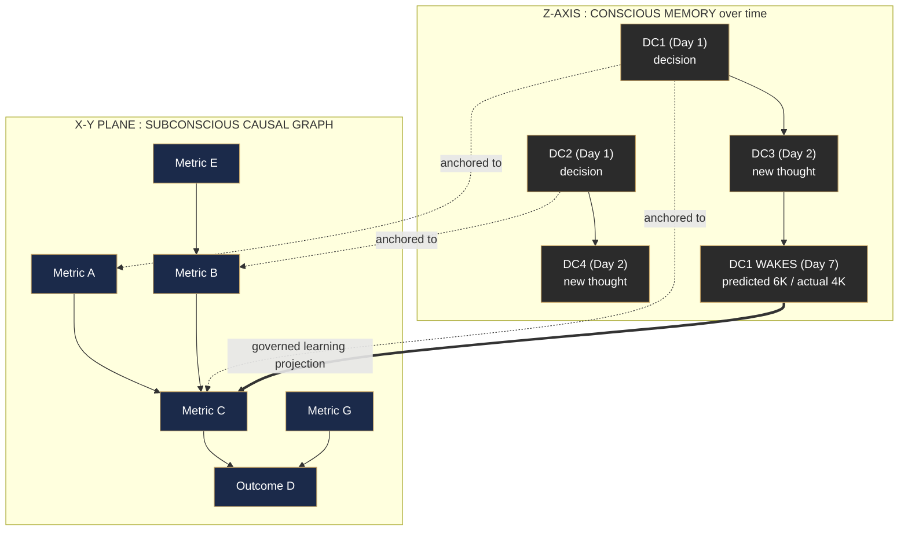


> **Architectural correction baked into the model (important):** Decision Capsules **MUST NOT** write themselves directly into the Causal Graph. They sit *above* it as episodic memory and project only *governed, classified* learnings downward (see Part XII). The Causal Graph is the company’s brain; we do not let every passing human comment rewrite it. There is always a governance layer between a capsule’s lesson and the subconscious it is allowed to change.

---


# Part II — Philosophical Foundations

ThoughtWire is, at its root, a **philosophy of how a thinking institution should behave**, rendered into software. The founding poster frames this as a classical lineage. We keep that framing because it is not ornament — each figure encodes a non-negotiable behavior of the system. Every builder should be able to point at any feature and say which philosophical commitment it serves.

The poster’s own summary line is the creed:

> *“Thoughtlets gather where silos divide. Thoughts emerge where signals align. With intent as compass, and policy as guide.”*

## 2.1 Socrates — Inquiry

**Commitment:** *Question every signal to surface meaning.*

A raw signal is never taken at face value. Before a Thoughtlet is allowed to become part of a Thought, the system interrogates it: Is this real or noise? What does it actually mean? What is it a symptom *of*? The Investigation Agent is fundamentally Socratic — it traverses *upstream* asking “what caused this?” and refuses to accept the surface reading. This is why ThoughtWire monitors *decisions* and *causes*, not just numbers: a number is an answer; ThoughtWire is built to keep asking the question behind it.

> **Design consequence:** No recommendation may be produced without an explicit reasoning chain that includes what was *ruled out* and what was *assumed*. A Thought that cannot show its inquiry is not a Thought.

## 2.2 Plato — Alignment

**Commitment:** *Align emerging Thoughts with enterprise intent.*

Plato gives us the *north star*: mission, vision, values, policy, intent. A Thought is not merely “technically correct” — it must be *aligned* with what the enterprise is trying to be. The Causal Graph therefore stores not only mechanical relationships but **policies, thresholds, and intent** as first-class nodes. Every recommendation is checked against them. Intent is the **compass**; policy is the **guide**. An action that makes money but violates a policy or contradicts the company’s stated intent is, by definition, a bad Thought.

> **Design consequence:** Policy and intent are not a final compliance gate bolted on at the end; they are woven into the graph the agent reasons *from*, so alignment is native, not an afterthought.

## 2.3 Aristotle — Judgment

**Commitment:** *Turn reasoning into grounded action and learning.*

Aristotle is the practical philosopher — the loop of **Observe → Analyze → Decide → Act → Feedback**, and crucially the insight that *wisdom comes from acting and then learning from the consequences* (the Lyceum, below). ThoughtWire’s entire decision-and-learning cycle is Aristotelian: it does not stop at knowing; it acts (with permission) and then *reflects on the outcome to become wiser*. Judgment is the bridge from thinking to doing to learning.

> **Design consequence:** Every Thought that executes MUST close its own loop via a Monitoring Contract and Outcome Learning. Reasoning that never confronts its real-world result is forbidden — it is “knowledge without judgment.”

## 2.4 The architectural metaphors (the buildings and grounds)

The poster renders the system as a classical estate. Each structure is a layer:

- **The House of Thought** — the crafted *structure* for continuous enterprise thought. This is ThoughtWire itself, the whole brain.
- **The Agora of Signals** — the marketplace where *many enterprise voices gather*: markets, customers, systems, teams on one side; events, risks, opportunities on the other. This is the **Thoughtlet Stream**: the place where scattered signals from everywhere arrive and mingle.
- **The Academy of Intent** — the *north star for aligned movement*: mission, vision, values, policy arranged around a guiding star. This is the **intent/policy substrate** of the Causal Graph (the Platonic layer made concrete).
- **The Lyceum of Action** — *practical wisdom made operational*: a path from **Decisions → Action → {Impact, Learning}**. This is the **execution-and-learning** half of the system (the Aristotelian layer made concrete).
- **Columns as Silos** — *separate functions, one enterprise structure*: Sales, Marketing, Finance, Operations, Supply Chain, HR, Product, Customer, Data/IT, each a column. The point is structural unity: silos are real, but they hold up **one roof**. ThoughtWire’s job is to let Thoughtlets *gather across* the columns even though the columns themselves stay separate.

## 2.5 The signal-to-thought ascent

The poster’s panels 9 and 10 describe the system’s motion, and they are worth stating as a principle:

- **From Signals to Thoughts (panel 9):** discrete signals — *demand shift, margin pressure, pipeline drag, inventory tension, policy risk, customer sentiment* — first condense into **Thoughtlets**, and scattered Thoughtlets then **gather into shared judgment**: a **Thought**. This is the bottom-up condensation that the rest of this document specifies mechanically.
- **Enterprise in Motion (panel 10):** the journey **Aligned Thoughts → Decisions → Action → Learning → Growth**, drawn as a road winding from a tree (roots/values) toward a city (realized outcomes). The enterprise *moves, learns, and grows.* This is the promise: ThoughtWire is not a static tool; it is a thing that grows *with* the company.

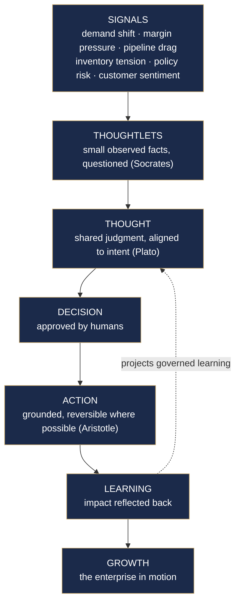


> **Why the philosophy is load-bearing:** When a builder agent must make a judgment call this document did not anticipate, it should resolve it by asking: *Does this serve Inquiry, Alignment, or Judgment? Does it let Thoughtlets gather across silos? Does it keep intent as compass and policy as guide?* The philosophy is the tie-breaker.

---

# Part III — Canonical Glossary

This glossary is **authoritative**. Where the brainstorm used several words for one thing, this section picks the canonical term and flags the synonyms so no one is confused. Builder agents MUST use these canonical terms in code, schemas, and UI labels.


| Canonical Term                                       | Synonyms heard in brainstorm                                                                    | Definition                                                                                                                                                                                                                                                                                                                     | Mind analogy                             |
| ---------------------------------------------------- | ----------------------------------------------------------------------------------------------- | ------------------------------------------------------------------------------------------------------------------------------------------------------------------------------------------------------------------------------------------------------------------------------------------------------------------------------ | ---------------------------------------- |
| **Cognitive Graph**                                  | “the brain”, “ThoughtWire brain”                                                                | The entire 6-layer system. The whole mind.                                                                                                                                                                                                                                                                                     | The mind                                 |
| **Causal Graph**                                     | “subconscious brain”, “X-Y plane”, “the body/surroundings”                                      | The stable, structural model of the business: metrics, policies, thresholds, owners, tools, and **causal edges** between them. A **Temporal Causal DAG** (see below).                                                                                                                                                          | Subconscious                             |
| **Thoughtlet**                                       | “sensory signal”, “small observed fact”                                                         | A single, small, atomic observation derived from enterprise signals. e.g. “ROAS dropped 18%.”                                                                                                                                                                                                                                  | A single sense-perception                |
| **Thought**                                          | “decision capsule”, “decision packet”, “decision”                                               | A conscious episode: a structured deliberation that combines multiple Thoughtlets into a reasoned recommendation with expected gain/loss, confidence, evidence, and an approval path. **“Thought” and “Decision Capsule” are the same object**; we say *Thought* for the concept and *Decision Capsule* for the stored record. | A conscious episode / a thought          |
| **Thoughtlet → Thought composition**                 | “multiple thoughtlets come together to form a thought”                                          | The rule that one Thought is composed of N Thoughtlets.                                                                                                                                                                                                                                                                        | Perceptions gathering into a realization |
| **Decision Capsule (DC)**                            | “decision packet”, “capsule”                                                                    | The persistent, stored record of a Thought across its whole life — including evidence, approvals, edits, execution, monitoring, and outcome learning. DCs stack along the Z-axis (DC1, DC2, …).                                                                                                                                | An episodic memory                       |
| **Capsule Agent**                                    | “the agent that created the decision”, “long-running agent”, “the agent that sits till the end” | The agent identity bound to a single Decision Capsule. It **does not run continuously**; it is *rehydrated* on wake. To the human it feels like “the same agent came back.”                                                                                                                                                    | The self that owns a memory              |
| **Investigation Agent**                              | “an agent wakes up and looks at the blast radius”                                               | The agent role that traverses the Causal Graph (upstream causes, downstream blast radius), gathers evidence, and authors a Thought.                                                                                                                                                                                            | The act of deliberating                  |
| **Blast radius**                                     | “drives downstream”, “what it influenced”                                                       | The set of downstream metrics/outcomes a node (or a decision) can affect.                                                                                                                                                                                                                                                      | Consequences                             |
| **Approval Graph / Workflow**                        | “approval workflow”, “the court”, “standing before the judge”                                   | The ordered path of humans (and their scoped authority) who must approve a Thought before it acts.                                                                                                                                                                                                                             | Social reasoning                         |
| **Monitoring Contract**                              | “monitoring service”, “hooks”, “wake conditions”, “memory promise”                              | The future-facing promise attached to an approved Thought: what to watch, what the expected outcome is, and the conditions that wake the Capsule Agent.                                                                                                                                                                        | A promise to your future self            |
| **Wake condition / Hook**                            | “hooks in signals”, “get back to me if…”                                                        | A trigger (event-based or time-based) that rehydrates the Capsule Agent.                                                                                                                                                                                                                                                       | A reminder                               |
| **Quick / Immediate Learning**                       | “short-term learning”, “the door-finger learning”                                               | Learning captured *during approval*, available the very next decision.                                                                                                                                                                                                                                                         | Same-night conscious learning            |
| **Outcome / Meta Learning**                          | “long-term learning”, “the friendship learning”                                                 | Learning captured *after monitoring*, when predicted vs. actual is reconciled; changes judgment and calibration.                                                                                                                                                                                                               | Delayed meta-learning                    |
| **Learning Candidate**                               | “the learning that the human taught”                                                            | A *proposed* learning that has not yet been validated or promoted. Must pass governance before touching the Causal Graph.                                                                                                                                                                                                      | An unverified hunch                      |
| **Promoted Memory**                                  | —                                                                                               | A Learning Candidate that has passed governance and is allowed to project into the Causal Graph or harness.                                                                                                                                                                                                                    | A confirmed, integrated lesson           |
| **Learning Projection**                              | “projection of that learning onto the knowledge graph”, “new connections between nodes”         | The governed act of writing a Promoted Memory back into the subconscious as one of four types (new edge / confidence update / investigation rule / episodic memory).                                                                                                                                                           | Integrating a lesson into intuition      |
| **Context Pack**                                     | “auto-injected context”, “feels at home”                                                        | The deterministically-assembled bundle of context the harness injects into an agent at wake so it never has to ask “where is the data?”.                                                                                                                                                                                       | Waking up oriented                       |
| **Context Injection Harness**                        | “the harness”, “Claude Code with Agent SDK”                                                     | The deterministic runtime that builds Context Packs, enforces required context, manages wake/rehydrate, and forbids “casual” memory.                                                                                                                                                                                           | The mechanism of recall                  |
| **Reverse Temporal Context Injection (RKI lineage)** | “reverse temporal context injection”, “RKI plan”                                                | The mechanism by which a *current* trigger retrieves *past* capsules anchored to the same graph nodes and injects their learnings into the present agent — letting the system reason with the company’s accumulated memory.                                                                                                    | Remembering the past while acting now    |
| **Decision-level monitoring**                        | “monitor a given decision packet, not just a metric”                                            | The core differentiator: monitoring a *bundle* tied to one decision, not a lone metric.                                                                                                                                                                                                                                        | Watching whether a choice was right      |
| **Ingestion Brain**                                  | “LLM ingestion”, “agent brain”, “the classifier”                                                | The LLM stage that reads an API’s OpenAPI spec, groups endpoints into Endpoint Families, and assigns each a role and field mappings. **It classifies; it never writes to the graph** (see FR-ING-005).                                                                                                                          | Perception, not action                   |
| **Endpoint Family**                                  | “endpoint group”, “path template”                                                               | A set of API operations collapsed under one path template + method + response-schema signature (e.g. `/api/v1/{dashboard}/metrics/{metric_id}` ×55). The unit the Ingestion Brain classifies.                                                                                                                                  | A recognized category of stimulus        |
| **SourceProfile**                                    | “API map”, “mapping”, “classification result”                                                   | The persisted, content-hashed output of the Ingestion Brain for one API source: per-family roles, confidences, and response-field→node-property mappings. Human-reviewable; approved once; reused (no LLM) while the spec hash is unchanged.                                                                                   | A learned mental map of a place          |
| **Harvester**                                        | “API ingester”, “deterministic executor”                                                        | The deterministic stage that executes an approved SourceProfile against the live API and emits node/edge **Proposals** — never direct graph writes.                                                                                                                                                                            | Habitual skilled action                  |
| **Evidence Ledger**                                  | “edge evidence”, “confidence history”                                                           | The append-only log of evidence events (supports/refutes, tier, weight, attribution) from which every causal edge’s confidence is deterministically recomputed (see §5.7).                                                                                                                                                     | The experiences behind an intuition      |


> **Naming rule for builders (`FR-GL-001`, MUST):** Code, database tables, API fields, and UI strings MUST use the canonical terms above. Where a synonym is more natural for end users in the UI, the underlying identifier MUST still map to the canonical term (e.g. a UI button “Decision” maps to entity `Thought`/`DecisionCapsule`).

---


# Part IV — The Six-Layer Brain (Architecture Overview)

The single most important architectural rule in this whole document:

> `**FR-ARCH-001` (MUST):** ThoughtWire MUST be built as **six separate-but-connected memory layers**. Everything MUST NOT be poured into one graph. The Causal Graph MUST NOT become a junk drawer. Each layer has a distinct rate of change, owner, and read/write discipline.

The six layers:


| #   | Layer                                | What it holds                                                                                                                                        | Rate of change                   | Mind analogy              |
| --- | ------------------------------------ | ---------------------------------------------------------------------------------------------------------------------------------------------------- | -------------------------------- | ------------------------- |
| 1   | **Causal Graph**                     | Stable business anatomy: metrics, policies, thresholds, owners, causal edges, confidence weights, investigation rules, approval rules, tool bindings | Slow, governed                   | Subconscious structure    |
| 2   | **Thoughtlet Stream**                | Live, small observations flowing in from systems                                                                                                     | Real-time, ephemeral-ish         | Senses                    |
| 3   | **Decision Capsule Ledger**          | Every Thought ever proposed: evidence, reasoning, approvals, edits, execution, outcome                                                               | Append-mostly, immutable history | Conscious episodic memory |
| 4   | **Human Teaching / Learning Memory** | Tribal knowledge captured from approvals; promoted learnings                                                                                         | Medium, governed                 | Learned judgment          |
| 5   | **Monitoring Contracts**             | Future promises: watch this, wake on that, review then                                                                                               | Created per-decision, expires    | Promises to future self   |
| 6   | **Context Injection Harness**        | The runtime that assembles context, enforces it, wakes agents                                                                                        | Operational                      | The act of recall         |


> Note: The brainstorm sometimes counts “5 memory layers” (1–5 above) and treats the harness (6) as the runtime that *uses* them. Both framings are correct. We canonically list **six** because the harness is load-bearing enough to be named as a layer. The “Learning Memory” (4) and the governance pipeline that feeds it are the connective tissue between the conscious ledger (3) and the subconscious graph (1).

## 4.1 The full loop (the canonical system diagram)

This is *the* diagram. It belongs on the wall.

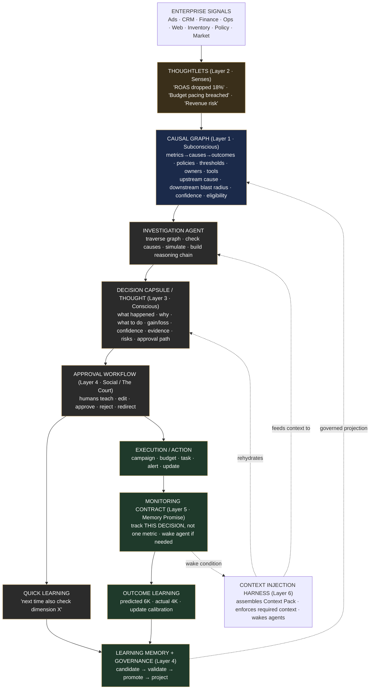


## 4.2 The distinction that defines the company

State it on every deck, in every onboarding:

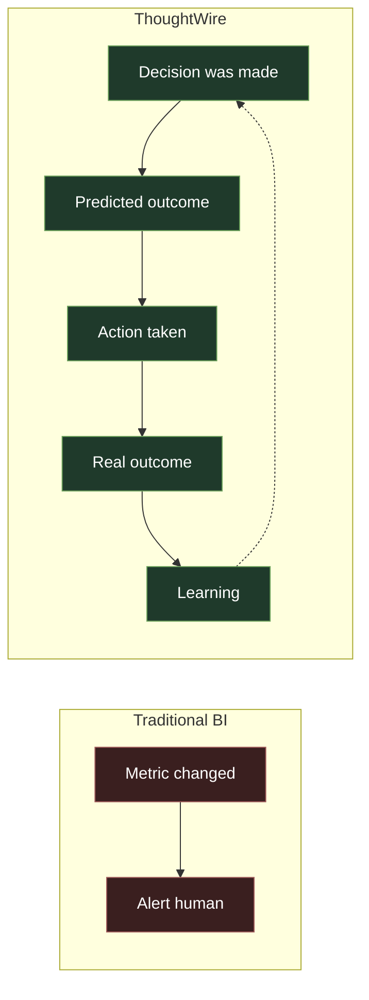


A metric alert says: *“Revenue is down.”*

A ThoughtWire decision monitor says: *“Seven days ago we approved a campaign adjustment expected to recover $6,000 at 80% confidence. Actual recovery is $4,000. The gap appears linked to lower-than-expected mobile conversion. Future similar recommendations should reduce confidence or require mobile conversion as an investigation dimension.”*

> `**FR-ARCH-002` (MUST):** Every approved Thought that takes a real-world action MUST produce a Monitoring Contract, and that contract MUST be reconciled into Outcome Learning. The loop `decision → prediction → action → real outcome → learning` is mandatory and MUST NOT be left open.

---


# Part V — Layer 1: The Causal Graph (The Subconscious)

## 5.1 Purpose and feel

The Causal Graph is the business’s **subconscious body**. When an agent operates inside ThoughtWire it should *feel at home* — it should never have to ask “where is the revenue data?” or “what affects CAC?” or “who owns the ad budget?” The graph already encodes all of that. It is the difference between a stranger fumbling in a dark house and a person who lives there and can find the light switch with their eyes closed.

The graph answers, at all times, five questions for any node:

1. **Upstream cause** — what influences this?
2. **Downstream blast radius** — what does this influence?
3. **Policy & threshold** — what rules govern this, and what’s the breach line?
4. **Confidence** — how strong/reliable is each relationship?
5. **Action eligibility** — what is allowed to be done here, by whom, with what tools?

## 5.2 What the graph stores

> `**FR-CG-001` (MUST):** The Causal Graph MUST represent, as first-class nodes and/or attributes:
>
> - **Metrics** (e.g. ROAS, revenue, CAC, margin, conversion rate, AOV, inventory level)
> - **Causal edges** between metrics (cause → effect), each carrying a **confidence weight** and a **temporal lag** (see Temporal DAG below)
> - **Outcomes** (business results that metrics roll up into: revenue realization, fulfillment, retention)
> - **Policies** (rules the business must obey: spend caps, brand constraints, compliance limits)
> - **Thresholds** (the breach lines that turn an observation into a Thoughtlet of concern)
> - **Owners** (the human/role accountable for each metric or domain — needed to build approval paths)
> - **Tools / Actions** (what can be *done* to influence a node, and the connector that does it)
> - **Investigation rules** (promoted learnings telling agents what to check before recommending — e.g. “for budget-shift Thoughts, check mobile conversion”)
> - **Approval rules** (which roles must approve which classes of action)
> - **Business context** (domain, segment, seasonality notes, data-quality warnings)

> **Where these entities come from:** Metrics, Thresholds, Policies, Dashboards, Components (charts), Domains, and Endpoints are **derived from the live operational API** — the enterprise’s analytics backend described by its OpenAPI spec (for BC Analytics: `http://localhost:8005` + `/openapi.json`). Static seed files (dbt CSVs) are retired as an ingestion source. The full mechanism is §5.6 (`FR-ING-*`).
>
> **Ontology stance:** the node labels above are a **fixed core vocabulary** — every downstream layer (traversal, Thoughtlet anchoring per FR-TL-002, Decision Capsules, the canvas) depends on knowing what a label means. The Ingestion Brain adaptively decides *which API surface maps onto which core label*; when it meets surface that fits no core label (e.g. ML models), it emits a `label_extension` proposal into the review queue, and human approval grows a governed **label registry**. The schema can grow; it is never mutated on the fly.

> `**FR-CG-002` (MUST):** Every edge MUST carry a **confidence weight** that is updatable by the governed learning pipeline (Part XII), and MUST NOT be silently overwritten by ad-hoc processes.

## 5.3 The Temporal Causal DAG (the one correction to “DAG”)

The original idea called this a *directed acyclic graph*. **In the real world a pure DAG is wrong**, because business has feedback loops:

```
Ad Spend → Traffic → Revenue → Budget → Ad Spend   (a cycle!)
```

You cannot pretend the business has no loops. But you also do not want to lose the clean reasoning a DAG gives you. The resolution:

> `**FR-CG-003` (MUST):** The Causal Graph MUST be modeled as a **Temporal Causal DAG**: edges are acyclic *once time is included*. The mental model is **“Metric at time T causes another metric at time T+1.”**

```
Ad Spend (today)
   ↓
Traffic (tomorrow)
   ↓
Revenue (in 3 days)
   ↓
Budget adjustment (next week)
   ↓
Ad Spend (next cycle)
```

The loop becomes a spiral down the time axis — acyclic, traversable, and honest about lag. This also means **blast-radius traversal is time-aware**: when the agent asks “what will this budget shift affect, and *when*?”, the graph answers with both the nodes and the lags.

> `**FR-CG-004` (MUST):** Causal edges MUST carry a **temporal lag** attribute so that blast-radius and upstream traversal can answer *when*, not only *what*.

## 5.4 Traversal behaviors the graph MUST support

> `**FR-CG-005` (MUST):** Given a node (a breached metric), the system MUST be able to traverse **upstream** to enumerate candidate causes, ranked by edge confidence and lag plausibility.

> `**FR-CG-006` (MUST):** Given a node or a proposed action, the system MUST be able to traverse **downstream** to compute the **blast radius** — the set of metrics/outcomes that could be affected, with lags — so that a Thought can list *both* intended effects and possible collateral effects (this directly feeds guardrail metrics in Monitoring Contracts).

> `**FR-CG-007` (SHOULD):** The system SHOULD support **counterfactual/what-if simulation** over the graph (“if we shift $3,000 from Meta to Google, what does the graph predict for revenue at T+5?”), used by the Investigation Agent to estimate gain/loss.

## 5.5 Governance: the graph is sacred

> `**FR-CG-008` (MUST):** The Causal Graph MUST NOT be mutated directly by Decision Capsules, by raw human comments, or by agents acting casually. **All** changes to the graph MUST flow through the governed Learning Projection pipeline (Part XII): `Learning Candidate → Validation → Promoted Memory → Projection`.

> `**FR-CG-009` (MUST):** Every projection onto the graph MUST be **attributable** — it MUST record which Decision Capsule(s) and which outcome produced it — so that the graph’s evolution is fully auditable and any edge/confidence can be traced back to the experience that justified it.

> `**FR-CG-010` (SHOULD):** The graph SHOULD version its structure so that, for any past Decision Capsule, the system can reconstruct *what the subconscious believed at the time the decision was made* (needed for honest “why did you decide that?” answers and for fair outcome attribution).

## 5.6 Provisioning the subconscious: adaptive API ingestion

The subconscious has to come from somewhere. ThoughtWire does not hand-author its body, and it does not read static seed files: it **reads the enterprise’s own operational API** and derives the graph from it. Point the system at an OpenAPI spec — a URL, a base URL (probing `/openapi.json`), or an uploaded file — and a four-stage pipeline builds the subconscious:

1. **Stage A — Spec acquisition (deterministic).** Fetch the spec, content-hash it, and collapse its operations into **Endpoint Families** (path template + method + response-schema signature). Infrastructure surface — `auth`, `login/logout/token`, `health`, `ready`, `admin`, `docs`/`redoc`/`openapi`, pool/status plumbing — is stamped *excluded* by built-in deny patterns before anything else happens. A single truncated live sample per family grounds the next stage.
2. **Stage B — The Ingestion Brain (LLM, once per spec hash).** An LLM classifies each family into a role (metric catalog, threshold catalog, policy catalog, dashboard catalog, chart catalog, causal-edge catalog, dashboard data, metric value, chart data, ML model, auth, admin, ignore) and writes response-field→node-property mappings. The output is a persisted **SourceProfile**. The brain **classifies; it never writes to the graph.**
3. **Human gate.** The SourceProfile is previewed — families, roles, confidences, rationales — and a human overrides, excludes, and approves. Overrides are recorded with HUMAN provenance.
4. **Stage C + D — Harvest and arbitration (deterministic).** The **Harvester** executes the approved profile against the live API and emits node/edge **Proposals**; arbitration — the one writer (FR-CG-008) — dedupes, validates, and promotes them.

The defining property: **the LLM writes the mapping once; deterministic code executes it.** Re-ingesting an unchanged API costs zero LLM calls and zero human attention.

> `**FR-ING-001` (MUST):** The Causal Graph MUST be bootstrapped exclusively from a live REST API described by an OpenAPI spec. Static seed files (dbt CSVs) MUST NOT be read as an ingestion source.

> `**FR-ING-002` (MUST):** The system MUST accept a spec via URL, base URL (auto-probing `/openapi.json`), or file upload, and MUST handle any valid OpenAPI 3.x document — no provider-specific endpoint lists in code.

> `**FR-ING-003` (MUST):** An LLM classifier (the Ingestion Brain) MUST group endpoints into families and assign each family a role, a confidence, and response-field→node-property mappings, persisted as a **SourceProfile** keyed by the spec’s content hash.

> `**FR-ING-004` (MUST):** A SourceProfile MUST be human-reviewable before any harvest. Users MUST be able to override roles and exclude families, and overrides MUST be recorded with HUMAN provenance.

> `**FR-ING-005` (MUST):** Harvesting MUST be deterministic — no LLM calls at harvest time. The Harvester MUST emit only Proposals and MUST NOT write to the graph (the Ingestion Brain classifies; arbitration writes — FR-CG-008).

> `**FR-ING-006` (MUST):** All harvested proposals MUST flow through arbitration, and classification confidence MUST be carried in provenance so that trust in a node or edge is priced by how it was discovered.

> `**FR-ING-007` (MUST):** Re-ingestion MUST be idempotent. An unchanged spec hash MUST short-circuit re-classification (cached SourceProfile); a changed hash MUST trigger a drift diff and re-classification of the changed surface only.

> `**FR-ING-008` (SHOULD):** Ingestion SHOULD stream progress events (stage transitions, per-label promotion counts) so humans can watch the subconscious being built.

> `**FR-ING-009` (SHOULD):** The pipeline SHOULD work unmodified against any analytics API exposing an OpenAPI spec — adaptive by design, not hardcoded to BC Analytics.

> `**FR-ING-010` (MUST):** Ingestion MUST be **incremental, never a rebuild**. Adding a source, or re-ingesting a source that grew new endpoints/metrics, MUST re-classify only the changed families, MERGE additively into the existing graph, and mark disappeared entities `DEPRECATED` — entities MUST NOT be deleted (FR-CG-010 reconstructability).

> `**FR-ING-011` (MUST):** Infrastructure endpoints (auth, login/token, health, ready, admin, docs/openapi, operational plumbing) MUST be auto-excluded — by deterministic deny patterns plus the classifier’s judgment — and MUST be re-includable only by explicit human override.

> `**FR-ING-012` (MUST):** The system MUST support **multiple API sources**: a registry of SourceProfiles whose harvests merge into one graph, with per-source provenance on every node and edge.

> `**FR-ING-013` (MUST):** Metric identity MUST be **canonical-first**. A metric MUST be keyed by its central-library `metric_id`, and a metric exposed by N dashboards MUST be a **single `:Metric` node linked by N `SHOWN_ON` edges**, never duplicated per dashboard. A raw metric id that does NOT resolve against the central library MUST be namespaced `<dashboard>-<id>` (e.g. `meta-overview-roas`) so that semantically-distinct, same-named dashboard-local metrics never silently merge. Prefixing is the fallback; global dedup is the rule when the concept is shared.

> `**FR-ING-014` (MUST):** The harvester MUST consume the catalog’s explicit metric-relationships endpoint (`master-config/config/knowledge-graph/relationships`) as a **primary deterministic edge source** (endpoints resolved to canonical slugs), and MUST also capture dashboard-local metrics that exist only in endpoint **descriptions** (`Available metrics:` blocks) or as **literal per-metric path segments** (e.g. `monthly-review/metrics/mer`), emitting them with `SHOWN_ON`/`EXPOSED_BY` and routing such prose-derived proposals to review. Formula decomposition, the catalog ontology edges, statistical inference, and LLM proposals remain **corroborating** evidence folded through the same ledger.

> `**FR-ING-015` (SHOULD):** Each ingestion run SHOULD emit a **completeness coverage report** reconciling, per dashboard, the metric ids discoverable from the spec (central-library membership ∪ description-scraped ∪ literal segments) against the metrics actually promoted (canonical or namespaced), surfacing any `missing` ids and the GET-only / infra-excluded tally — so that “every metric is in the graph” is a checkable artifact rather than an assumption.

> `**FR-ING-016` (SHOULD):** The system SHOULD offer an **opt-in autonomous mode**: a single action (spec URL / base URL / file) that runs discover → auto-approve → harvest end-to-end and **auto-promotes the entire DETERMINISTIC graph** (catalogs, per-dashboard trees, relationships-endpoint edges, formula decomposition, membership) with NO human role-table gate and an **empty review queue**. The speculative producers (`propose_edges_llm`, statistical inference) MUST remain governed — an autonomous run MUST NOT invoke them. The governed multi-step flow MUST remain the default; autonomy is reached via an explicit flag / tool / button.

> `**FR-ING-017` (SHOULD):** Dashboard-local metrics that do not resolve to a central-library metric SHOULD be assigned a `category` by a **single bounded LLM call**, strongly preferring the library's existing category vocabulary and emitting `BELONGS_TO → Domain`. The call MUST be a service-layer seam (NOT inside the deterministic harvester — FR-ING-005), **cached per spec hash** so re-runs make no LLM call, and a graceful no-op when no LLM backend is configured.

## 5.7 Edge confidence: the evidence ledger

FR-CG-002 says every edge carries a confidence that is never silently overwritten. This section says **where that number comes from**: not from any single judge, but from an **append-only Evidence Ledger** folded into one score.

Every signal about a causal edge — an LLM hypothesis, a lagged cross-correlation from statistical inference, a quasi-experimental result, a monitoring-contract reconciliation, a human confirm/refute — is an **evidence event**: `{edge, tier, direction: supports|refutes, weight, attribution, timestamp}`. Evidence tiers carry pseudo-count weights (PRIOR ≈ 1, OBSERVATIONAL ≈ 2–5 scaled by effect size and FDR, QUASI-EXPERIMENTAL ≈ 5, INTERVENTIONAL ≈ 8, HUMAN ≈ 10). The edge’s Beta parameters are a deterministic fold over its ledger — `supports` adds to α, `refutes` adds to β, from a Jeffreys prior — and:

- **confidence** = α / (α + β) — the one aggregated score on the edge;
- **evidence mass** = α + β — distinguishing “0.8 from one LLM guess” from “0.8 from forty observations”;
- formula-decomposition edges (`DECOMPOSES_INTO`) are deterministic mathematics and are pinned at confidence 1.0, outside the ledger.

Traversal consumes this directly: upstream-cause and blast-radius queries rank candidate paths by **path score = Π edge confidence × lag plausibility**, returning both score and cumulative lag — which is exactly what a Decision Capsule needs to cite a weighted causal chain (“ROAS ← CPC ← bid strategy, path score 0.61, ~48h lag”).

> `**FR-SCORE-001` (MUST):** Every causal edge’s confidence MUST be a deterministic fold over an append-only evidence ledger. No process — agent, tool, or human — may set the score directly or overwrite it in place (strengthens FR-CG-002).

> `**FR-SCORE-002` (MUST):** Every evidence event MUST carry its tier, direction (supports/refutes), weight, and source attribution, so any edge’s confidence can be traced to the experiences that produced it (extends FR-CG-009).

> `**FR-SCORE-003` (MUST):** Upstream and downstream traversal MUST rank results by path score (product of edge confidences with lag plausibility) so Decision Capsules receive weighted, time-aware causal paths (realizes FR-CG-005/006).

> `**FR-SCORE-004` (SHOULD):** Wherever a confidence is shown to humans or injected into agent context, the evidence mass SHOULD accompany it, so calibrated honesty (low evidence ≠ low truth, but low certainty) is preserved.

### Real-world grounding

A marketing analyst who has worked at a company for five years carries this graph in their head: they *know* that shifting budget off Meta tends to hurt mid-funnel retargeting two days later, that the VP of Finance must sign off above $5k, that the brand team is touchy about discount language. ThoughtWire’s Causal Graph is that five-year analyst’s intuition, **made explicit, shared, and queryable by every agent and human at once.** That is what “subconscious of the enterprise” means in practice.

---


# Part VI — Layer 2: The Thoughtlet Stream (The Senses)

## 6.1 Purpose and feel

Thoughtlets are the system’s **senses** — the live, small, raw perceptions arriving from the enterprise’s many systems. A Thoughtlet is the smallest unit of “something happened.” On its own it is nearly meaningless; its value comes from being **gathered with others** into a Thought. This is the poster’s *Agora of Signals*: markets, customers, systems, teams, events, risks, and opportunities all arriving in one square.

## 6.2 What a Thoughtlet is

> `**FR-TL-001` (MUST):** A Thoughtlet MUST be an **atomic observation** — a single fact with a value, a direction, a magnitude, a source, and a timestamp. Examples: *“Google Ads ROAS dropped 18%”*, *“Meta spend pacing 22% over plan”*, *“Mobile conversion dropped 9%”*, *“Top-SKU inventory healthy.”*

> `**FR-TL-002` (MUST):** Each Thoughtlet MUST be **anchored to one or more Causal Graph nodes** so that the system immediately knows where in the business body this perception belongs.

> `**FR-TL-003` (MUST):** Each Thoughtlet MUST carry **provenance** (which system/connector produced it, the underlying query/source) and a **data-quality flag** so that downstream reasoning can discount unreliable senses.

## 6.3 The Socratic filter

> `**FR-TL-004` (MUST):** Thoughtlets MUST be **questioned, not trusted on sight** (Socratic Inquiry). The system MUST distinguish *signal* from *noise* before a Thoughtlet is allowed to contribute to a Thought — e.g. via threshold checks, anomaly significance, and data-quality gating defined in the Causal Graph.

> `**FR-TL-005` (SHOULD):** A Thoughtlet that breaches a policy or threshold defined in the Causal Graph SHOULD be marked as a **concern Thoughtlet**, which is what typically triggers the Investigation Agent to wake.

## 6.4 Composition: how senses become a thought

> `**FR-TL-006` (MUST):** The system MUST support **composition of multiple Thoughtlets into one Thought**. A Thought references the set of Thoughtlets it was built from (its evidentiary senses). The number of Thoughtlets per Thought is variable.

> `**FR-TL-007` (SHOULD):** The system SHOULD support **correlation** across Thoughtlets arriving from different silos (the Agora point: signals from Sales, Finance, and Ops gathering across the columns) so a single Thought can reason over the whole picture, not one department’s slice.

### Real-world grounding

Walking into a kitchen you smell smoke (one Thoughtlet), see the pan is dark (another), hear the smoke alarm (another). No single sense is a decision. Gathered, they compose a Thought: *“Dinner is burning; I should turn off the stove.”* ThoughtWire’s stream is exactly this — many small senses, individually mute, gathering into a judgment.

---


# Part VII — The Investigation Agent (Forming a Thought)

## 7.1 Purpose

When a concern Thoughtlet appears (or on a schedule, or on a human’s prompt), an **Investigation Agent** wakes. It is the *act of deliberating*. Its job is to turn raw senses into a defensible, aligned, structured Thought — and never to simply react.

## 7.2 What the Investigation Agent MUST do

> `**FR-IA-001` (MUST):** On waking, the Investigation Agent MUST receive a **Context Pack** from the harness (Part XIII) before reasoning. It MUST NOT have to ask “where is the data?” — orientation is the harness’s job, not the agent’s.

> `**FR-IA-002` (MUST):** The agent MUST traverse the Causal Graph **upstream** (candidate causes) and **downstream** (blast radius) for the implicated nodes, using `FR-CG-005`/`FR-CG-006`.

> `**FR-IA-003` (MUST):** The agent MUST gather **evidence**: the Thoughtlets used, metrics checked, upstream causes considered, downstream blast radius, **similar past Decision Capsules** (via reverse temporal context injection, Part XIII), and external/contextual factors.

> `**FR-IA-004` (MUST):** The agent MUST honor all **investigation rules** promoted into the graph for this class of decision (e.g. “check mobile conversion before recommending a budget shift”). If a required dimension’s data is missing, the agent MUST flag it and MUST NOT silently omit it. (This is how immediate learning becomes binding — see Part XII.)

> `**FR-IA-005` (MUST):** The agent MUST produce a **reasoning chain** that includes: why it believes what happened, its **assumptions**, its **confidence**, **alternative explanations considered**, and **what it ruled out** (Socratic requirement — no black-box conclusions).

> `**FR-IA-006` (MUST):** The agent MUST estimate **expected upside** (if acted on) and **expected downside** (if ignored), each with a **confidence**, a **timeline**, and the graph reasoning that produced them.

> `**FR-IA-007` (MUST):** The agent MUST check the candidate recommendation against **policy and intent** nodes (Platonic Alignment). A recommendation that violates policy MUST be blocked or reshaped, not surfaced as-is.

> `**FR-IA-008` (MUST):** The agent MUST package all of the above into a **Decision Capsule** (Part VIII) and MUST NOT take any real-world action itself — it only proposes. Action requires approval (Part IX).

> `**FR-IA-009` (SHOULD):** The agent SHOULD assess **reversibility** of the proposed action and prefer reversible actions where confidence is lower.

## 7.3 The boundary: propose, never act

This is a hard line and worth stating twice. The Investigation Agent (and later the rehydrated Capsule Agent) is a **petitioner**, not a **judge** and not an **executor**. It builds the case. Humans judge it. Only after judgment, and only through sanctioned tools, does action occur.

---


# Part VIII — Layer 3: The Decision Capsule Ledger (Conscious Episodes)

## 8.1 Purpose and feel

If the Causal Graph is the subconscious, the **Decision Capsule Ledger is the conscious life history** of the AI — every decision it has ever made or proposed, with everything it believed, was told, did, and learned. This is where “the life of the AI lives.” The capsules stack along the Z-axis (DC1, DC2, …) and each is anchored to the graph nodes it touched.

> `**FR-DC-001` (MUST):** Every Thought MUST be persisted as a **Decision Capsule** in an **append-mostly, immutable ledger**. Edits during approval MUST be recorded as new versioned states, not overwrites — the history of how a Thought changed is itself memory.

> `**FR-DC-002` (MUST):** Every Decision Capsule MUST be **anchored** to the Causal Graph nodes it reasoned over, so future triggers on those nodes can retrieve it (reverse temporal context injection, Part XIII).

> `**FR-DC-003` (MUST):** A Decision Capsule MUST NOT directly mutate the Causal Graph. It MAY *propose* learnings, which flow through governance (Part XII).

## 8.2 The canonical Decision Capsule structure (ten sections)

> `**FR-DC-004` (MUST):** Every Decision Capsule MUST contain the following ten sections. (Field-level shapes are illustrative — see Appendix A — but the *presence and meaning* of each section is binding.)

**1. Identity** — Thought ID; which agent created it; created-at time; business domain; priority.

**2. Trigger** — what happened; which metric/policy breached; severity; detection source (which Thoughtlets).

**3. Evidence** — Thoughtlets used; metrics checked; upstream causes; downstream blast radius; similar past decisions retrieved; external/contextual factors.

**4. Reasoning** — why the agent believes this happened; assumptions; confidence; alternative explanations; what was ruled out.

**5. Recommendation** — proposed action; expected upside; expected downside if ignored; timeline; required tools/systems; reversibility.

**6. Approval Path** — who must approve; in what order; *why each person is needed*; *what each person is allowed to change*.

**7. Human Feedback** — what each human corrected; what new dimension was added; how the estimate changed; whether this should become future memory (and of what type).

**8. Execution** — what was actually done; when; by whom / which agent; in which system; full audit trail.

**9. Monitoring Contract** — expected outcome; metrics to monitor; guardrail conditions; wake-up conditions; review date.

**10. Outcome Learning** — predicted result; actual result; the gap; explanation of the gap; calibration update; reusable learning.

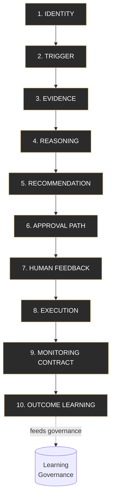


## 8.3 The capsule is alive (the Capsule Agent)

Each Decision Capsule is **not just a record** — it is wrapped by a **Capsule Agent**: the identity of “the person who created this decision.” Whenever a human has a question about that decision, or a wake condition fires, *that* agent can answer — because it carries (via rehydration) exactly the context that produced the decision.

> `**FR-DC-005` (MUST):** Each Decision Capsule MUST be associated with a **Capsule Agent identity** that can be **rehydrated** (Part XIV) to answer questions about, defend, monitor, or update its own decision. The agent MUST NOT be implemented as a perpetually-running process (see `FR-AGT-001`).

> `**FR-DC-006` (SHOULD):** When good outcomes occur, the Capsule Agent SHOULD record a positive reinforcement against the relevant graph relationships (via governance); when bad outcomes occur, it SHOULD record the corrective learning. This is the “reward itself / punish itself, and reflect it onto the subconscious” behavior — always through governance, never by direct mutation.

### Real-world grounding

A Decision Capsule is a *case file* that can speak. Imagine if every major decision your company ever made came with a person who was *there*, remembers exactly why it was made, what they assumed, who signed off and why, what they were told to watch — and who will wake up the moment the situation it was worried about actually happens, and can explain themselves honestly afterward. That is the ledger.

---


# Part IX — Layer 4: The Approval Graph (Social Reasoning / The Court)

## 9.1 The court metaphor — taken seriously

This is the soul of the product’s *experience*. The agent that created the Thought is **brought before humans the way a petitioner is brought before a court** — not to be rubber-stamped, but to have its case examined, corrected, and (if it earns it) approved. The agent is **not the judge**. The agent is **the one bringing the case**.


| Court role                   | ThoughtWire entity                       |
| ---------------------------- | ---------------------------------------- |
| Investigator / petitioner    | The Capsule Agent presenting the Thought |
| Evidence file                | The Decision Capsule                     |
| Domain judge                 | Approver 1 (e.g. Marketing Director)     |
| Operational / creative judge | Approver 2 (e.g. Creative Lead)          |
| Financial judge              | Approver 3 (e.g. Finance)                |
| Execution judge              | Approver 4 (e.g. Platform/Ops owner)     |
| Court order becoming real    | The final, executed action               |


The agent stands before the first approver and, in effect, says: *“This happened. I looked at these things. I believe X. If you act on my recommendation, you will make ~$8,000 with 80% confidence. If you ignore it, you will lose ~$Y. Here is exactly how I reasoned, here are my assumptions. Please approve.”*

## 9.2 Approval is structured reasoning, not yes/no

> `**FR-AP-001` (MUST):** Approval MUST be modeled as **structured human reasoning**, not a binary yes/no. Each approval step MUST capture the human’s *question*, what they *can edit*, what they *cannot edit*, and any *teaching* they add.

> `**FR-AP-002` (MUST):** Each approver MUST approve only **their slice** of the Thought. An approver MUST NOT be able to edit fields outside their authority (e.g. Marketing cannot edit Finance’s spend cap; Finance cannot edit execution logs). Authority scopes MUST be derived from owner/approval rules in the Causal Graph.

> `**FR-AP-003` (MUST):** The approval path (who, in what order, why each is needed) MUST be **derived from the company’s real decision flow** as encoded in the Causal Graph’s owners and approval rules — not hardcoded per feature. (e.g. for a marketing campaign: Marketing Director → Creative Lead → Finance → Execution Owner.)

> `**FR-AP-004` (MUST):** When a human edits or redirects, the Thought MUST be **re-reasoned** against the change, and its estimates MUST be updated transparently. The agent MUST acknowledge the teaching and show the revised numbers.

> `**FR-AP-005` (MUST):** Each step’s outcome (approved / rejected / edited / redirected) and the human’s teaching MUST be written into the Decision Capsule’s *Human Feedback* section (`FR-DC-004` §7) and forwarded as a **Learning Candidate** (Part XII).

### Illustrative approval-step behavior (non-binding shapes; binding *behavior*)

```
Step 1 — Marketing Director
  Question:   "Is the strategic recommendation valid?"
  Can edit:   audience, channel, campaign goal, timing, strategic assumptions
  Cannot edit: finance approval, legal approval, execution logs

Step 2 — Creative Lead
  Question:   "Is the creative direction right?"
  Can edit:   copy direction, visual inspiration, brand constraints, tone

Step 3 — Finance
  Question:   "Is the spend justified?"
  Can edit:   budget, spend cap, ROI threshold, risk tolerance

Step 4 — Execution Owner
  Question:   "Can this safely go live?"
  Can edit:   launch time, tool execution, rollback conditions, monitoring contract
```

## 9.3 The teaching moment (where immediate learning is born)

The defining interaction: an approver says *“You looked at five metrics — but what about the sixth angle?”* The agent must do four things, in order:

1. **Investigate the new angle** — actually go look, using the graph and tools.
2. **Acknowledge and credit the human** — “You’re right, I didn’t view it that way; thank you for teaching me.”
3. **Revise transparently** — “Originally I estimated $8,000. Accounting for the dimension you raised, I now estimate ~$6,000.”
4. **Emit a Learning Candidate** — “For this *class* of decision, the sixth dimension should be checked,” tagged for governance/classification.

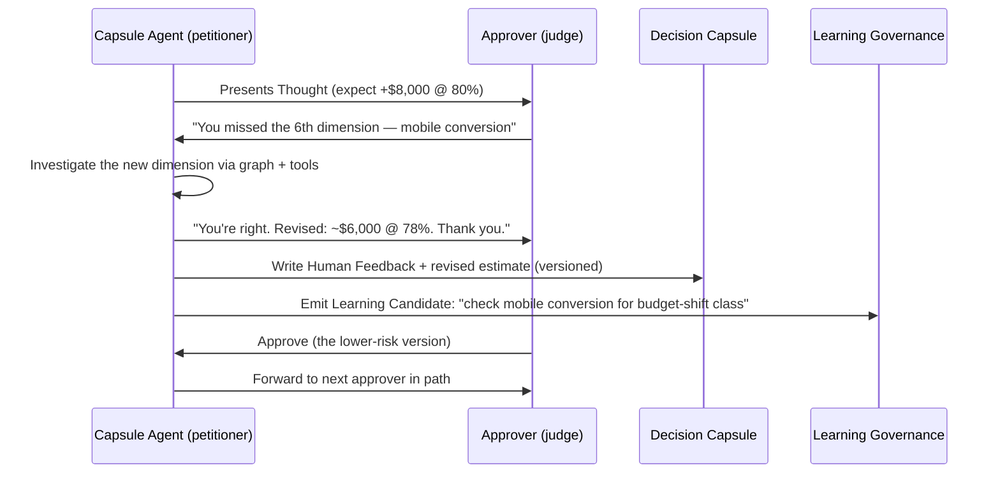


> `**FR-AP-006` (MUST):** Teaching captured at approval MUST be available to the **very next** relevant Thought (immediate learning, Part XII), so the system never forces a human to repeat “I told you this yesterday.”

---


# Part X — Execution (Becoming Real)

Up to the final approval, **nothing in the real world has changed.** Everything before execution was the agent and the humans *fine-tuning a plan* — the agent saying “I want to do this in your company,” and working with human employees to earn permission and absorb their tribal knowledge. The agent is, in effect, another employee — one that must get sign-off and learns from the people it works with.

> `**FR-EX-001` (MUST):** A real-world action MUST occur **only after the full approval path is satisfied**. Execution before final approval is prohibited.

> `**FR-EX-002` (MUST):** Execution MUST be performed through **sanctioned tools/connectors** bound in the Causal Graph, and MUST write a complete **audit trail** into the Decision Capsule’s Execution section (what, when, by which agent/tool, in which system).

> `**FR-EX-003` (MUST):** At execution, the **Monitoring Contract MUST be instantiated** (Part XI) before or atomically with the action, so no decision goes live unwatched.

> `**FR-EX-004` (SHOULD):** Where the approved action defined rollback conditions, the executor SHOULD register them so the Monitoring Contract can trigger rollback or alert.

---


# Part XI — Layer 5: Monitoring Contracts (Memory Promises)

## 11.1 The core differentiator, restated

Every company today monitors **metrics**. **Nobody monitors a *decision*.** A decision touches many metrics; whether we are actually holding that decision accountable for its promised effect — across all those metrics, with guardrails on the things it might break — is something no current tool does. This layer is the heart of why ThoughtWire is not BI.

> `**FR-MC-001` (MUST):** Every approved, executed Thought MUST create a **Monitoring Contract** that watches the **decision as a bundle** (e.g. “Monitor Thought #TW-10482”), not merely one isolated metric.

## 11.2 What a Monitoring Contract holds

> `**FR-MC-002` (MUST):** A Monitoring Contract MUST specify:
>
> - **Expected outcome** (e.g. “recover $6,000 in revenue”) with **timeline** and **confidence**.
> - **Primary metrics** — what success looks like (revenue, ROAS, conversion, spend, AOV).
> - **Guardrail metrics** — what must *not* break as a side effect (margin, CAC, refund rate, unsubscribe rate, inventory risk). These come from the downstream blast radius (`FR-CG-006`).
> - **Wake conditions / hooks** — event-based and time-based triggers that rehydrate the Capsule Agent.
> - **Review date** — the scheduled reckoning (e.g. day 7).

### Illustrative contract (binding *behavior*, non-binding shape)

```
Monitoring Contract — Thought #TW-10482
  Expected:    revenue recovery +$6,000 over 7 days @ 80% confidence
  Primary:     revenue, ROAS, conversion rate, campaign spend, AOV
  Guardrails:  margin, CAC, refund rate, email unsubscribe rate, inventory risk
  Wake if:     revenue tracking < $3,000 by day 4
               spend exceeds approved cap
               CAC rises above threshold
               margin drops below guardrail
               a negative downstream metric appears
  Review:      day 7 (outcome learning)
```

## 11.3 Two kinds of hooks

> `**FR-MC-003` (MUST):** The contract MUST support **time-based hooks** (“come back to me in 7 days”) and **event/condition-based hooks** (“wake me if downside risk starts materializing” / “if a security condition occurs”). Either MUST be able to rehydrate the Capsule Agent (Part XIV).

> `**FR-MC-004` (MUST):** When a guardrail/wake condition fires *before* the review date (i.e. the decision is going wrong — losing money instead of making it), the system MUST rehydrate the Capsule Agent promptly so it can **alert humans and/or take sanctioned corrective action**, rather than waiting passively for the review date.

> `**FR-MC-005` (SHOULD):** Contracts SHOULD expire/close on review-and-reconciliation so the monitoring layer does not accumulate stale promises (avoiding the junk-drawer failure mode at the monitoring layer).

### Real-world grounding

This is the difference between a smoke detector and a doctor following up after surgery. A smoke detector (BI alert) screams when one thing crosses a line. A surgeon’s follow-up (Monitoring Contract) says: “I expected this recovery on this timeline; I’m watching not just the incision but your temperature, your bloodwork, and your mobility; call me immediately if *these* warning signs appear; and either way, come back on day 7 so we can compare what I expected to what actually happened — and so I get better at predicting next time.”

---


# Part XII — Layer 6 (Learning Memory): How ThoughtWire Learns

This is where ThoughtWire stops being a tool and becomes a mind that *grows with the company*. Two loops, two speeds — exactly mirroring the two human parables from Part I.

## 12.1 The two learning loops

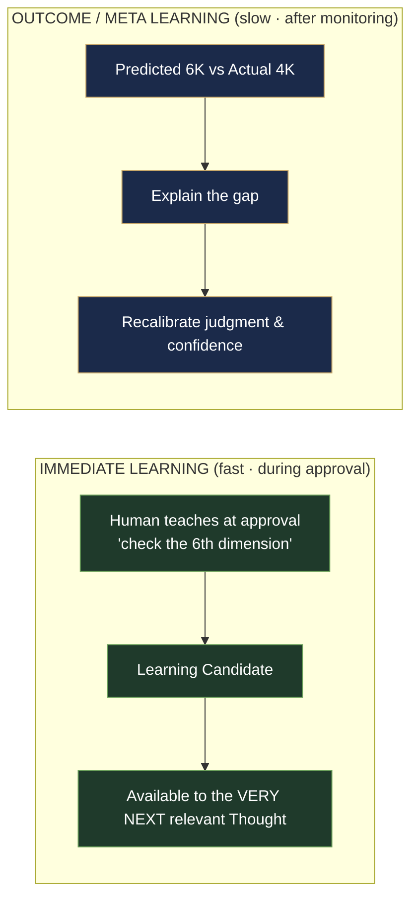


### Loop 1 — Immediate Learning (the door & the finger)

> `**FR-LRN-001` (MUST):** Learning captured during approval MUST be usable by the **next relevant Thought immediately** — not after a monitoring window. If a human says “check mobile conversion before budget-shift recommendations,” the next budget-shift Thought MUST include it (and MUST block its final recommendation if that data is missing, per `FR-IA-004`).

This is the system’s promise that it will never force a human to say *“Bro, I already told you this yesterday.”* It is the same-night rule the child learns about the door.

### Loop 2 — Outcome / Meta Learning (the cooled friendship)

> `**FR-LRN-002` (MUST):** At a Monitoring Contract’s review (or when an outcome is known), the system MUST reconcile **predicted vs. actual**, MUST **explain the gap**, and MUST produce a **calibration update** plus any **reusable learning**.

> `**FR-LRN-003` (MUST):** Calibration MUST be able to adjust *either* the magnitude estimate *or* the confidence for that class of decision. (e.g. for “predicted $6,000 @ 80%, got $4,000”: next time the system MAY say “$6,000 @ 65%” *or* “$4,000 @ 80%” — both are valid recalibrations and the system must be able to express either.)

This loop changes **judgment itself**, not just a single rule — the meta-lesson that “my actions affect the world and the world responds.” It is what lets ThoughtWire say, after a few cycles: *“For this class of decision, my magnitude estimates run hot, and mobile conversion is a hidden limiter; so I now recommend budget-shift **paired with** landing-page conversion repair, expected $4,500–$6,500 @ 82%.”*

## 12.2 The governance pipeline (do NOT mutate the brain directly)

The single most important *safety* rule of the learning system:

> `**FR-LRN-004` (MUST):** No learning — from a human comment or from an outcome — MUST write to the Causal Graph directly. **Every** learning MUST first become a **Learning Candidate**, pass **validation/classification**, become a **Promoted Memory**, and only then **project** into the graph or harness. Random human comments MUST NOT be allowed to poison the company brain.

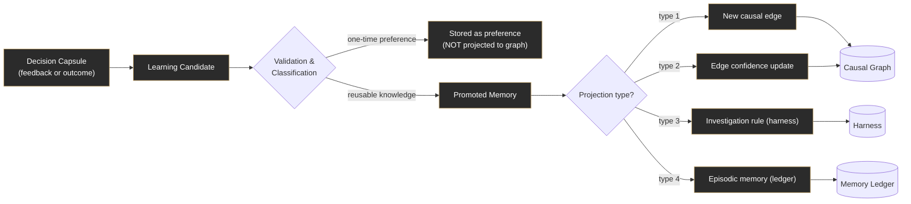


## 12.3 Classification: not all feedback is equal

> `**FR-LRN-005` (MUST):** Each Learning Candidate MUST be **classified** before promotion. The system MUST distinguish at least: *one-time preference* · *reusable tribal knowledge* · *new investigation rule* · *new/updated causal edge* · *confidence calibration update*. Classification determines whether and how it projects.

## 12.4 The four projection types

> `**FR-LRN-006` (MUST):** A Promoted Memory MUST project as exactly one (or a deliberate combination) of these four types — they MUST NOT be conflated:


| #   | Projection type            | What it changes                                                 | Example                                                              |
| --- | -------------------------- | --------------------------------------------------------------- | -------------------------------------------------------------------- |
| 1   | **New causal edge**        | Adds a relationship to the Causal Graph                         | “Mobile conversion affects campaign recovery”                        |
| 2   | **Edge confidence update** | Reweights an existing relationship                              | “Budget-shift → revenue recovery is weaker than we thought”          |
| 3   | **Investigation rule**     | Adds a *required check* to the harness for a class of decisions | “Before recommending a budget shift, check mobile conversion”        |
| 4   | **Episodic memory**        | Stores a narrative lesson in the ledger                         | “In May 2026, this action underperformed because mobile UX was weak” |


> `**FR-LRN-007` (MUST):** Every projection MUST be **attributable** to the originating Decision Capsule(s) and outcome (ties to `FR-CG-009`), so the brain’s growth is auditable and reversible.

## 12.5 The two timings of projection (the DC1–DC4 / Z-axis picture)

The brainstorm’s image is correct and we formalize it:

- **Day 1:** DC1 and DC2 are created. **Immediate** learnings (from approval conversations) project onto the graph *that day* — new connections appear (e.g. the “sixth dimension” / mobile-conversion edge), so DC3/DC4 tomorrow won’t repeat the mistake.
- **Day 2:** DC3 and DC4 are created, already benefiting from yesterday’s projected learning.
- **Day 7:** DC1’s Monitoring Contract matures. The Capsule Agent rehydrates, reconciles predicted-vs-actual, and a *second*, **outcome** learning projects onto the graph — layered on top of the earlier projection.

> `**FR-LRN-008` (MUST):** The system MUST support **two distinct projection timings** per decision: (a) immediate, at/after approval; (b) delayed, at/after monitoring review. Both MUST be attributable and governed.

> `**FR-LRN-009` (MUST):** The system MUST retain the **narrative memory** of what actually happened in the market (the story behind the numbers), not only the numeric calibration — because when a human later asks “why did you recommend this?”, the system must answer with the real evidence and the real history, just as it justified the decision at creation time.

### Real-world grounding (why two timings matter)

The child learns the door rule *the same night* (immediate) — that is the rule that prevents the next pinched finger. But the child only learns *“my actions damage trust”* a week later, when the friend stays distant (delayed meta-learning) — and that lesson reshapes how they treat people generally, far beyond doors. ThoughtWire needs both: the fast rule that stops tomorrow’s repeat mistake, and the slow wisdom that recalibrates judgment for a whole class of situations. Crucially, the human typically can’t recall *when* they learned the door rule; ThoughtWire, given retrieval tools, *can* — and that perfect recall of its own learning history is its superpower over the human pattern it imitates.

---


# Part XIII — The Context Injection Harness (Reverse Temporal Context Injection)

## 13.1 Purpose and feel

The harness is **the mechanism of recall** — and it is what makes the agent “feel at home.” An agent must **never search the enterprise blindly**. The moment it wakes, the harness has already set the table: the relevant subgraph, the policies, the similar past decisions, the human corrections, the tools, the approval path, the required monitoring pattern. The agent does not ask *“where is the data?”* It already knows: *“This is the business body I live inside.”*

This harness is to be built on **Claude Code + the Anthropic Agent SDK** as the runtime that orchestrates agents deterministically.

## 13.2 The Context Pack (required, deterministic, compulsory)

> `**FR-HAR-001` (MUST):** On every agent wake (investigation or rehydration), the harness MUST assemble and inject a **Context Pack**. The agent MUST NOT be allowed to skip it. Memory MUST NOT be “casual” — it is injected **compulsorily and deterministically**, in a fixed, machine-checkable format.

> `**FR-HAR-002` (MUST):** The Context Pack MUST contain, at minimum:
>
> 1. Current trigger summary
> 2. Relevant causal subgraph
> 3. Policies and thresholds
> 4. Upstream possible causes
> 5. Downstream blast radius
> 6. Similar past Decision Capsules (reverse temporal context injection)
> 7. Human corrections from prior approvals (promoted)
> 8. Promoted investigation rules for this class of decision
> 9. Previous prediction-vs-actual outcomes for this class
> 10. Available tools / actions
> 11. Approval workflow (who, order, scopes)
> 12. Required monitoring contract pattern
> 13. Known risks and data-quality warnings

## 13.3 Reverse Temporal Context Injection (the RKI lineage)

This is the mechanism that lets the present reason with the past — the conscious memory feeding the subconscious operation. It is the direct descendant of the **RKI / reverse temporal context injection** idea.

> `**FR-HAR-003` (MUST):** Given a current trigger, the harness MUST identify the touched Causal Graph nodes, **retrieve past Decision Capsules anchored to those nodes**, and inject their relevant learnings into the current agent’s context — so the agent “thinks with the company’s memory.”


> `**FR-HAR-004` (MUST):** The harness MUST enforce **required investigation rules** (`FR-IA-004`): if a class of decision has a promoted “must-check” dimension, the harness MUST ensure that dimension is present in context and MUST cause the agent to block its final recommendation if the data is missing.

> `**FR-HAR-005` (MUST):** All memory stored and retrieved through the harness MUST use a **deterministic, mandatory format**, so the harness can guarantee completeness rather than relying on an agent to “remember to remember.”

> `**FR-HAR-006` (SHOULD):** The harness SHOULD be the single chokepoint for tool permissions — an agent’s available actions in any session SHOULD be exactly those granted in its Context Pack, nothing more.

### Why deterministic, not “casual”

A human can forget to recall the right memory at the right moment. We refuse to let the agent do that. The harness does not *hope* the agent remembers the mobile-conversion rule; it *guarantees* the rule is in context and *enforces* the block if the data is missing. **The intelligence is in the agent; the discipline is in the harness.**

---


# Part XIV — The Capsule Agent Lifecycle (Sleep, Wake, Rehydrate)

## 14.1 The critical technical correction

The brainstorm imagined “a long-running agent that created the capsule and wanted to sit till the end.” Conceptually true — to the human it should *feel* like the same agent came back. But:

> `**FR-AGT-001` (MUST):** A Capsule Agent MUST NOT be implemented as a live process sleeping for days. Instead the system MUST **persist the capsule + agent-state snapshot + wake conditions + tool permissions + monitoring contract + context-rehydration recipe**, and **rehydrate** the agent when a wake condition fires.

This is safer, cheaper, auditable, and scalable — and, to the user, indistinguishable from “the same agent woke up.”

## 14.2 The rehydration sequence

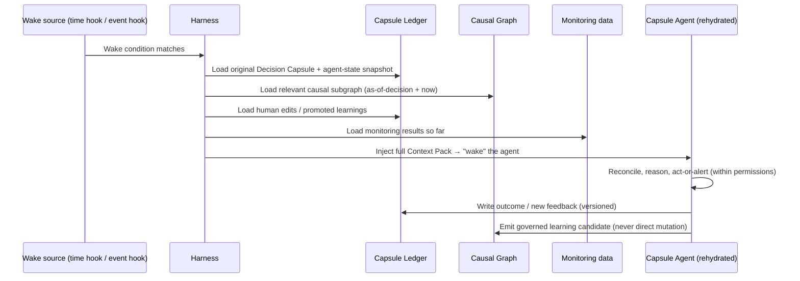


> `**FR-AGT-002` (MUST):** On rehydration the agent MUST receive a full Context Pack (`FR-HAR-002`) including the monitoring data accrued since the decision, and MUST operate strictly within the tool permissions stored in the capsule.

> `**FR-AGT-003` (MUST):** A rehydrated Capsule Agent MUST be able to: (a) **answer questions** about its decision (defend the case file); (b) **act or alert** within permissions if a guardrail fired; (c) **reconcile** predicted-vs-actual at review; (d) **emit governed learning candidates**.

> `**FR-AGT-004` (MUST):** The agent MUST present, to humans, a **continuous identity** (“the same agent that proposed this is back”), even though it is technically a fresh rehydration. Continuity of *identity and memory* is required; continuity of *process* is forbidden.

> `**FR-AGT-005` (SHOULD):** Agent-state snapshots SHOULD be versioned alongside the graph version (`FR-CG-010`) so a rehydrated agent can reason about *what it believed then* vs *what is true now*.

---


# Part XV — End-to-End Worked Example

This is the canonical narrative. Use it in demos and onboarding. It exercises every layer.

## Day 1 — Sensing

Five Thoughtlets arrive into the stream (Agora of Signals):


| Thoughtlet                       | Anchored node     | Note       |
| -------------------------------- | ----------------- | ---------- |
| Google Ads ROAS dropped 18%      | ROAS              | concern    |
| Meta spend pacing 22% over plan  | Spend             | concern    |
| Revenue down $14,000 vs expected | Revenue           | concern    |
| Top-SKU inventory healthy        | Inventory         | reassuring |
| Mobile conversion dropped 9%     | Mobile Conversion | concern    |


## Day 1 — Investigation

The Investigation Agent wakes with a Context Pack. It traverses the Causal Graph:

```
Ad Spend → Traffic Quality → Conversion Rate → Revenue
Inventory → Fulfillment Risk → Revenue Realization
Campaign Mix → CAC → Margin
```

It composes a Thought (Decision Capsule **#TW-10482**):

- **Recommendation:** Shift $3,000 from underperforming Meta ad sets into Google branded/search for 5 days.
- **Expected gain:** +$8,000 revenue recovery. **Confidence:** 80%.
- **Reasoning:** documented, with assumptions and ruled-out alternatives.

## Day 1 — The Court (Approval)

**Marketing Director** examines the case:

> *“You forgot mobile conversion. If mobile conversion is down, shifting budget may not fully recover revenue.”*

The agent investigates the sixth dimension, credits the human, and revises **transparently**:

- **New expected gain:** +$6,000. **Confidence:** 76–78%.
- **Immediate Learning Candidate emitted:** *“For budget-shift Thoughts, mobile conversion MUST be checked before final recommendation.”* → classified → promoted as an **Investigation Rule (type 3)** and projected to the harness **that day**.

The path continues: **Creative Lead** (brand fit) → **Finance** approves the lower-risk version (spend cap) → **Execution Owner** clears launch and rollback. Each edits only their slice.

## Day 1 — Execution + Contract

Action goes live through the sanctioned ad-platform connector. A **Monitoring Contract** is instantiated:

```
Expected:   +$6,000 over 7 days @ ~78%
Primary:    revenue, ROAS, conversion, spend, AOV
Guardrails: margin, CAC, refund rate, unsubscribe, inventory risk
Wake if:    revenue < $3,000 by day 4; spend > cap; CAC > threshold; margin < guardrail
Review:     day 7
```

## Day 2 — Memory already working

New Thoughts **DC3 / DC4** are created. Because yesterday’s investigation rule was projected immediately, any budget-shift Thought today **already includes mobile conversion** — the Marketing Director never has to repeat themselves.

## Day 7 — The Reckoning (Outcome Learning)

The contract matures; the Capsule Agent for #TW-10482 **rehydrates**, loads monitoring data, and reconciles:

- **Predicted:** +$6,000 @ ~78%. **Actual:** +$4,000.
- **Explanation of gap:** direction correct; magnitude overestimated; **mobile conversion suppressed upside**.
- **Governed learnings (delayed projection):**

1. **Confidence update (type 2):** lower confidence on `Budget Shift → Revenue Recovery`.
2. **Investigation rule reinforced (type 3):** mobile conversion remains required.
3. **Episodic memory (type 4):** “May 2026 — budget shift underperformed due to weak mobile UX.”
4. **New causal edge candidate (type 1):** `Mobile Conversion → Campaign Recovery` strength raised.

## Next time — Wiser

The same situation recurs. The agent now recommends:

> *“Don’t only shift budget — **also fix the mobile landing-page conversion issue**. Expected gain $4,500–$6,500 @ 82% confidence.”*

That is real learning: first the **rule** (“check mobile conversion”), then the **wisdom** (“budget alone won’t recover revenue when mobile UX is the limiter — pair the actions”). The door-and-finger rule, then the trust-and-consequences meta-lesson — in software.

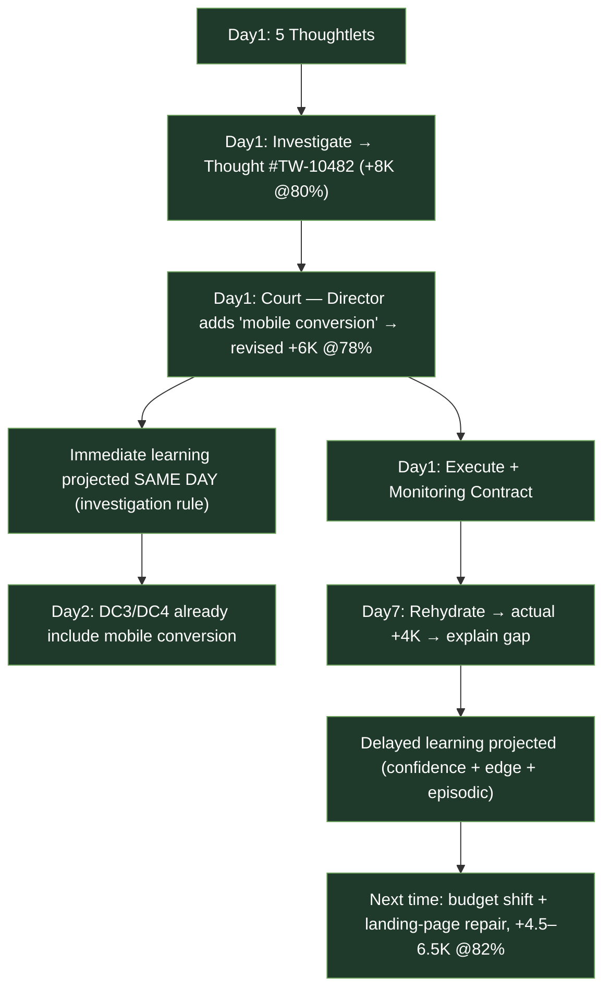


---


# Part XVI — Experience & Interaction Design

The feel of ThoughtWire is as load-bearing as the architecture. The product should feel like **working alongside a thoughtful new colleague who is brilliant, humble, accountable, and improving** — not like configuring a dashboard.

## 16.1 Design principles

> `**FR-UX-001` (MUST):** Decisions, not metrics, MUST be the primary objects in the UI. A user MUST be able to open a **Decision** (Decision Capsule) and see its whole life: trigger → evidence → reasoning → recommendation → who approved what → execution → monitoring → outcome → learning.

> `**FR-UX-002` (MUST):** The **court experience** MUST be honored in the UI: an approver sees a structured *case*, sees exactly *their* editable slice, can *teach* the agent inline, and watches the estimate update transparently in response.

> `**FR-UX-003` (MUST):** Every recommendation MUST be **explainable on demand** — “why did you recommend this?” MUST surface the real evidence, assumptions, ruled-out alternatives, and (if relevant) the past episodic memories that informed it.

> `**FR-UX-004` (MUST):** When the agent revises after teaching, it MUST **credit the human and show the delta** (”$8,000 → $6,000 because you raised mobile conversion”), so the human feels heard and the reasoning stays legible.

> `**FR-UX-005` (SHOULD):** The agent’s tone SHOULD be that of a humble, accountable colleague: it acknowledges correction, thanks the teacher, owns its misses at outcome time, and never pretends certainty it does not have.

> `**FR-UX-006` (SHOULD):** Monitoring SHOULD be presented as *decision accountability*, e.g. “3 of your approved decisions are on track, 1 is at risk (CAC guardrail approaching), 1 matured below forecast and updated its own confidence.”

## 16.2 Confidence is a first-class citizen of the UI

> `**FR-UX-007` (MUST):** Confidence and expected gain/loss MUST always travel together and MUST be shown honestly. The UI MUST be able to show a recalibrated confidence *dropping* over time as a feature, not a failure — “I used to say 80%; experience taught me 65% for this kind of move” is a sign of a maturing mind, and should read that way.

## 16.3 The emotional arc

The intended user feeling, stage by stage:


| Stage                 | What the user feels                                                              |
| --------------------- | -------------------------------------------------------------------------------- |
| First Thought arrives | “Oh — it noticed something real, and it explained itself.”                       |
| Approval              | “It’s asking my permission and actually listening when I push back.”             |
| Next day              | “It remembered what I told it. It didn’t make me repeat myself.”                 |
| Day 7                 | “It came back and told me the truth about how it did — and got humbler/smarter.” |
| Months in             | “It knows our business now. It feels like it works here.”                        |


---


# Part XVII — Cross-Cutting Requirements (Governance, Safety, Audit)

These apply to the whole system and override convenience anywhere they conflict with it.

> `**FR-X-001` Auditability (MUST):** Every state change — a Thought created, an edit made, an approval given, an action executed, a learning projected — MUST be attributable (who/what/when/why) and reconstructable. The system MUST be able to answer “why does the brain believe this today?” by tracing back through promoted memories to the capsules and outcomes that justified them.

> `**FR-X-002` Human authority (MUST):** No real-world action MUST occur without satisfying the approval path. The agent proposes; humans dispose. Scopes of authority MUST be enforced (`FR-AP-002`).

> `**FR-X-003` Graph integrity (MUST):** The Causal Graph MUST only change via governed projection (`FR-CG-008`, `FR-LRN-004`). No casual or direct mutation, ever.

> `**FR-X-004` Memory hygiene (MUST):** Each layer MUST maintain its own discipline so none becomes a junk drawer: the graph stays structural; the ledger stays append-mostly/immutable; monitoring contracts expire on reconciliation; learning candidates are classified before promotion.

> `**FR-X-005` Calibrated honesty (MUST):** The system MUST NOT present false precision. Confidence MUST reflect actual calibration history; when experience contradicts prior confidence, the system MUST adjust rather than defend.

> `**FR-X-006` Data-quality awareness (SHOULD):** Reasoning SHOULD carry data-quality warnings forward; a Thought built on shaky senses SHOULD say so and lower confidence accordingly.

> `**FR-X-007` Determinism of memory (MUST):** Memory injection MUST be deterministic and enforced by the harness (`FR-HAR-001`, `FR-HAR-005`), never left to agent discretion.

> `**FR-X-008` Reversibility bias (SHOULD):** Where confidence is lower, the system SHOULD prefer reversible actions and SHOULD register rollback conditions in the Monitoring Contract.

> `**FR-X-009` Multi-tenant isolation (SHOULD):** One company’s brain (graph, ledger, learnings) MUST NOT leak into another’s. Each enterprise grows its own mind. *(Stated as SHOULD here only because tenancy model is a build decision owned by the platform subagent; treat as MUST in any shared-platform deployment.)*

---


# Part XVIII — What ThoughtWire Is Not (Anti-Goals)

Stating the boundaries protects the vision. ThoughtWire is **not**:

1. **Not a dashboard / BI tool.** It does not stop at “the metric moved.” If a feature ends at an alert, it is out of scope or mislabeled.
2. **Not an autonomous actor.** It never acts without human approval. The petitioner-not-judge boundary is absolute.
3. **Not a single mega-graph.** Six layers, separate disciplines. Pouring everything into one graph is an explicit anti-pattern.
4. **Not a perpetual-process agent farm.** Agents rehydrate; they do not idle alive for days.
5. **Not a brain that rewrites itself on a whim.** Learnings are governed, classified, attributable, and reversible. A stray comment cannot reshape the company’s mind.
6. **Not a black box.** Every conclusion is explainable; every belief is traceable to experience.

---

# Closing: The Story to Tell

> ThoughtWire does not just watch metrics. It watches the **life of a decision**. It sees the signal, forms a Thought, brings it to humans like a petitioner before a court, learns from their judgment, acts only with permission, monitors the outcome it promised, and updates its future reasoning. It has a subconscious (the Causal Graph) that tells it *where it is* in the company, and a conscious memory (the Decision Capsule Ledger) that tells it *what it has lived through here*. It learns the way we do — a fast rule the same night, a slow wisdom a week later — but it remembers the way only a machine can. And so, with intent as its compass and policy as its guide, it grows with the company, decision by decision, into a mind that truly works here.

---


# Appendix A — Illustrative Data Shapes (NON-BINDING)

> These shapes exist to give a building subagent a concrete starting point. The **functional requirements above are binding**; these shapes are **suggestions**. A subagent owns the actual schema/storage choices (graph DB vs. relational, document store for capsules, time-series for monitoring, etc.).

### A.1 Causal Graph — node & edge (sketch)

```jsonc
// NODE
{
  "node_id": "metric.roas",
  "type": "metric",                 // metric | outcome | policy | threshold | owner | tool | rule
  "label": "Return on Ad Spend",
  "domain": "marketing",
  "owner_role": "marketing_director",
  "policies": ["policy.spend_cap"],
  "thresholds": [{ "name": "roas_drop", "op": "<", "value_pct": -15 }],
  "tools": ["tool.google_ads_budget"],
  "data_quality": "good"
}

// EDGE (Temporal Causal DAG)
{
  "edge_id": "e.spend_to_traffic",
  "from": "metric.ad_spend",
  "to": "metric.traffic_quality",
  "relation": "causes",
  "confidence": 0.72,               // updatable ONLY via governed projection
  "temporal_lag": "P1D",            // T -> T+1 (ISO-8601 duration)
  "provenance": ["dc.TW-10482"]     // attributable
}
```

### A.2 Decision Capsule (sketch — the ten sections)

```jsonc
{
  "thought_id": "TW-10482",
  "identity":      { "created_by": "agent.invest.0xA1", "created_at": "...", "domain": "marketing", "priority": "high" },
  "trigger":       { "breach": ["metric.roas","metric.revenue"], "severity": "high", "thoughtlets": ["tl.1","tl.5"] },
  "evidence":      { "thoughtlets": [...], "metrics_checked": [...], "upstream": [...], "blast_radius": [...],
                     "similar_past_dcs": ["TW-09980"], "external_factors": [...] },
  "reasoning":     { "hypothesis": "...", "assumptions": [...], "confidence": 0.80,
                     "alternatives_considered": [...], "ruled_out": [...] },
  "recommendation":{ "action": "shift $3000 Meta->Google 5d", "expected_upside_usd": 8000,
                     "expected_downside_if_ignored_usd": 14000, "timeline": "P5D",
                     "tools": ["tool.google_ads_budget","tool.meta_budget"], "reversibility": "high" },
  "approval_path": [ { "role": "marketing_director", "can_edit": ["audience","channel","timing"], "why": "strategy owner" }, ... ],
  "human_feedback":[ { "by": "marketing_director", "added_dimension": "mobile_conversion",
                       "estimate_before": 8000, "estimate_after": 6000, "make_memory": true, "memory_type": "investigation_rule" } ],
  "execution":     { "done": "...", "at": "...", "by": "agent.capsule.TW-10482", "system": "google_ads", "audit": [...] },
  "monitoring_contract_id": "mc.TW-10482",
  "outcome_learning": { "predicted_usd": 6000, "actual_usd": 4000, "gap_usd": -2000,
                        "explanation": "mobile conversion suppressed upside", "calibration": {...}, "reusable_learning": [...] },
  "anchored_nodes": ["metric.roas","metric.spend","metric.conversion","metric.revenue","metric.mobile_conversion","policy.spend_cap"],
  "version_log": [ ... ]            // append-mostly; edits are new versions
}
```

### A.3 Monitoring Contract (sketch)

```jsonc
{
  "contract_id": "mc.TW-10482",
  "thought_id": "TW-10482",
  "expected": { "metric": "revenue_recovery_usd", "value": 6000, "timeline": "P7D", "confidence": 0.78 },
  "primary_metrics":   ["revenue","roas","conversion_rate","campaign_spend","aov"],
  "guardrail_metrics": ["margin","cac","refund_rate","unsubscribe_rate","inventory_risk"],
  "wake_conditions": [
    { "type": "time",  "at": "P7D" },
    { "type": "event", "expr": "revenue < 3000 AND day >= 4" },
    { "type": "event", "expr": "spend > approved_cap" },
    { "type": "event", "expr": "cac > threshold" },
    { "type": "event", "expr": "margin < guardrail" }
  ],
  "status": "active"                 // active -> reconciled -> closed
}
```

### A.4 Learning Candidate (sketch)

```jsonc
{
  "candidate_id": "lc.0091",
  "source_dc": "TW-10482",
  "origin": "approval_feedback",     // approval_feedback | outcome_reconciliation
  "raw": "check mobile conversion before budget-shift recommendations",
  "classification": "investigation_rule",  // preference | tribal_knowledge | investigation_rule | causal_edge | confidence_update
  "projection_type": 3,              // 1 edge | 2 confidence | 3 rule | 4 episodic
  "status": "promoted",              // candidate -> validated -> promoted -> projected
  "projected_to": "harness.rules.budget_shift",
  "attribution": ["TW-10482"]
}
```

---


# Appendix B — Illustrative State Machines (NON-BINDING)

### B.1 Thought / Decision Capsule lifecycle

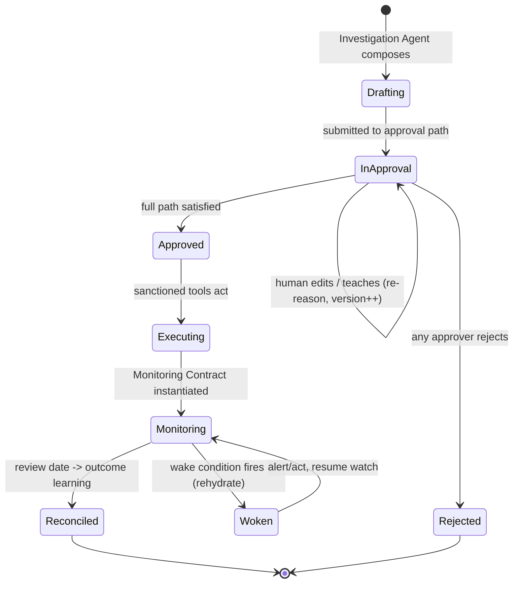


### B.2 Capsule Agent process lifecycle (rehydration, not idling)

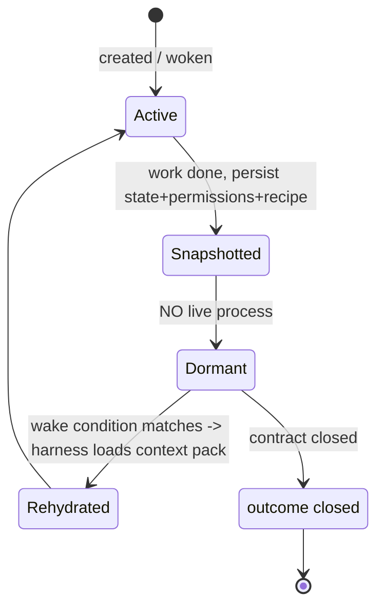


### B.3 Learning governance

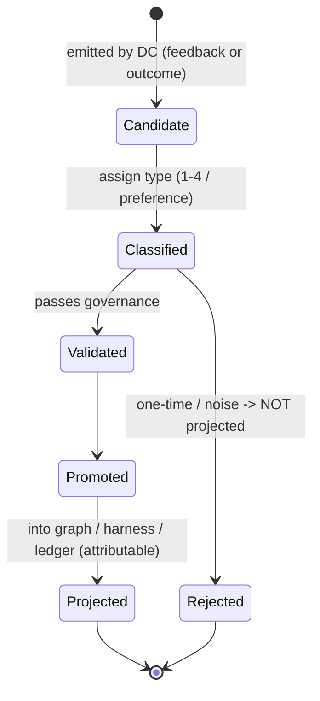


---


# Appendix C — Illustrative Context Pack Layout (NON-BINDING)

> The harness MUST produce all 13 elements (`FR-HAR-002`). This is one possible serialization for a Claude Code / Agent SDK harness.

```jsonc
{
  "context_pack_version": "1.0",
  "trigger_summary": "ROAS -18%, revenue -$14k, mobile conv -9% ...",
  "causal_subgraph": { "nodes": [...], "edges": [...] },
  "policies_thresholds": [...],
  "upstream_causes": [...],
  "downstream_blast_radius": [...],
  "similar_past_capsules": ["TW-09980", "TW-08812"],   // reverse temporal context injection
  "promoted_human_corrections": ["check mobile_conversion for budget_shift"],
  "promoted_investigation_rules": [ { "class": "budget_shift", "must_check": ["mobile_conversion"], "block_if_missing": true } ],
  "prior_pred_vs_actual": [ { "class": "budget_shift", "bias": "magnitude_overestimate", "n": 7 } ],
  "available_tools": ["tool.google_ads_budget","tool.meta_budget"],
  "approval_workflow": [ { "role": "marketing_director", "order": 1, "scope": [...] }, ... ],
  "required_monitoring_pattern": { "primary": [...], "guardrails": [...], "review": "P7D" },
  "risks_and_data_quality": [ "mobile_conversion source lag 6h" ]
}
```

---


# Appendix D — Requirement Index (for tasking subagents)

Hand a subagent a contiguous block of IDs and it knows exactly what it owns.


| Group                       | IDs                          | Owns                                                                                                                                    |
| --------------------------- | ---------------------------- | --------------------------------------------------------------------------------------------------------------------------------------- |
| **Glossary / naming**       | `FR-GL-001`                  | Canonical terminology in code/schema/UI                                                                                                 |
| **Architecture**            | `FR-ARCH-001`, `FR-ARCH-002` | Six-layer separation; the mandatory loop                                                                                                |
| **Causal Graph (L1)**       | `FR-CG-001` … `FR-CG-010`    | Graph contents, Temporal DAG, traversal, governance, versioning                                                                         |
| **API Ingestion (L1 provisioning)** | `FR-ING-001` … `FR-ING-017` | API as only source of truth, adaptive OpenAPI classification (SourceProfile), human-gated mappings, deterministic harvest, incremental delta ingestion, infra exclusion, multi-source registry, canonical-first metric identity, relationships-endpoint + prose-fallback completeness, coverage report, opt-in autonomous one-shot ingest, LLM category assignment |
| **Edge Confidence (L1 scoring)**    | `FR-SCORE-001` … `FR-SCORE-004` | Evidence ledger fold, attributable evidence events, path-score traversal, evidence mass alongside confidence |
| **Thoughtlets (L2)**        | `FR-TL-001` … `FR-TL-007`    | Atomic senses, anchoring, provenance, Socratic filter, composition, correlation                                                         |
| **Investigation Agent**     | `FR-IA-001` … `FR-IA-009`    | Orientation, traversal, evidence, rules, reasoning chain, estimates, alignment, propose-not-act                                         |
| **Decision Capsule (L3)**   | `FR-DC-001` … `FR-DC-006`    | Immutable ledger, anchoring, ten-section structure, Capsule Agent binding, reward/punish via governance                                 |
| **Approval (L4)**           | `FR-AP-001` … `FR-AP-006`    | Structured reasoning, scoped authority, derived paths, re-reason on edit, feedback capture, immediate availability                      |
| **Execution**               | `FR-EX-001` … `FR-EX-004`    | Post-approval only, sanctioned tools, audit, contract instantiation, rollback registration                                              |
| **Monitoring (L5)**         | `FR-MC-001` … `FR-MC-005`    | Decision-level bundle, contract contents, time+event hooks, pre-review intervention, expiry                                             |
| **Learning (L6)**           | `FR-LRN-001` … `FR-LRN-009`  | Two loops, governance pipeline, classification, four projection types, attribution, two timings, narrative memory                       |
| **Harness**                 | `FR-HAR-001` … `FR-HAR-006`  | Compulsory deterministic Context Pack, RKI retrieval, rule enforcement, format, tool chokepoint                                         |
| **Capsule Agent lifecycle** | `FR-AGT-001` … `FR-AGT-005`  | Rehydration not idling, full context on wake, capabilities, continuous identity, versioned snapshots                                    |
| **Experience / UX**         | `FR-UX-001` … `FR-UX-007`    | Decisions-as-objects, court UX, explainability, credit-the-human, colleague tone, accountability view, honest confidence                |
| **Cross-cutting**           | `FR-X-001` … `FR-X-009`      | Audit, human authority, graph integrity, memory hygiene, calibrated honesty, data quality, deterministic memory, reversibility, tenancy |


## Suggested build order (dependency-aware)

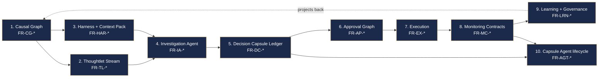


---

*End of document. This is the canonical v1.0 context layer for ThoughtWire — The Cognitive Graph. Share with the full team. Hand sections (by FR-ID range) to building subagents. Update via versioned revision only.*